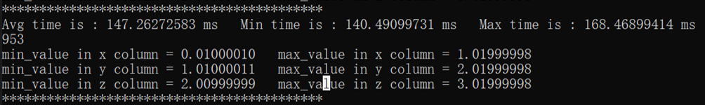
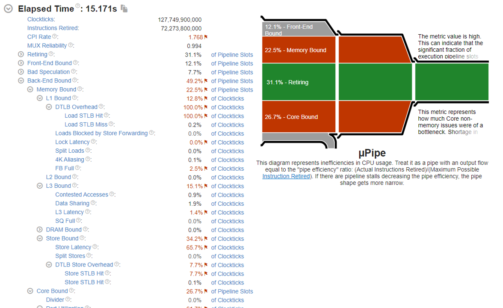
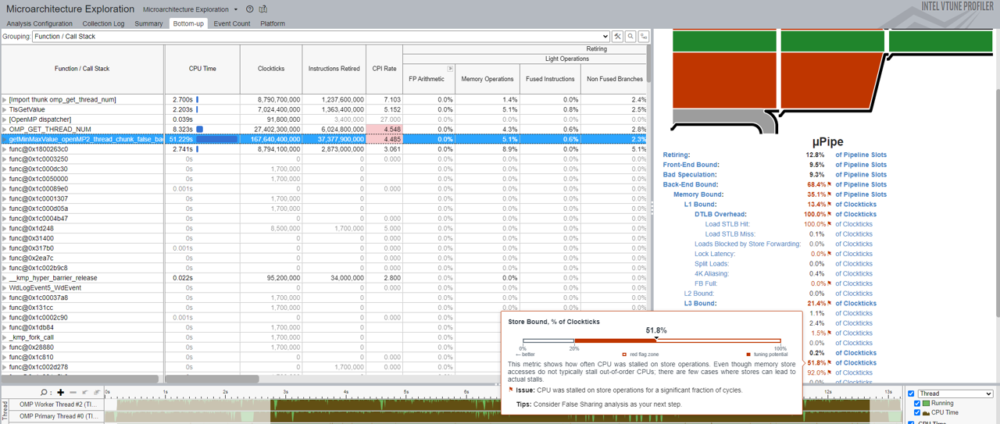
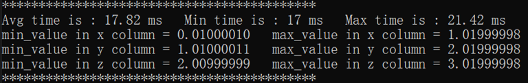
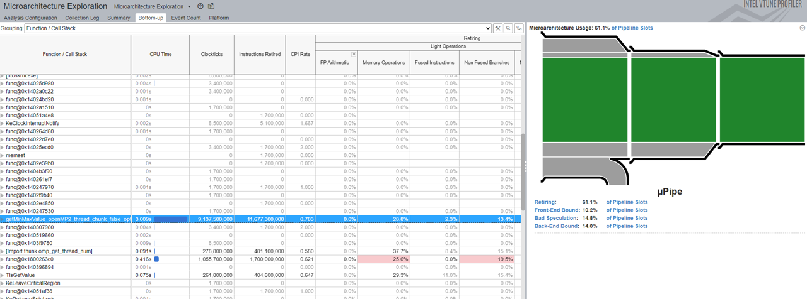
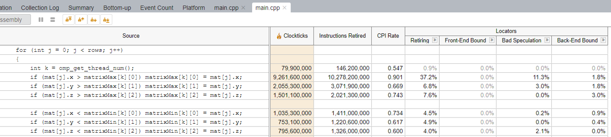

# False Sharing Tutorial with VTune

## **Introduction**

The sample application implements a basic Minmax function, using the C++ programming languages. This tutorial shows how to improve performance by solving false sharing in Visual Studio Professional 2019 Version 16.11.15 and VTune Profiler 2022.2.0. In this tutorial, you need to switch default Compiler to Intel Compiler.

## Initial Minmax() 

Before testing the Minmax(), you should first create a Point struct. It is consist of three float numbers to store 3d coordinate value of a Point. Then you can create a vector to store many Points. This is the basic data structure of this tutorial. 

In Minmax function, you can obtain the min/max axis value of all points. In order to unify the function interface, there are some useless parameters for this or later edition of Minmax().

```c++
struct Point {
    float x; float y; float z;
};

vector<Point> mat;

void MinmaxValue(vector<Point>& mat, int rows, int thread, int chunk, float ans[6]) {
	int coreNum = omp_get_num_procs();
	float matrixMin_x[8];
	float matrixMin_y[8];
	float matrixMin_z[8];

	float matrixMax_x[8];
	float matrixMax_y[8];
	float matrixMax_z[8];

	for (int i = 0; i < coreNum; i++)
	{
		matrixMin_x[i] = mat[0].x;
		matrixMin_y[i] = mat[0].y;
		matrixMin_z[i] = mat[0].z;

		matrixMax_x[i] = mat[0].x;
		matrixMax_y[i] = mat[0].y;
		matrixMax_z[i] = mat[0].z;
	}

#pragma omp parallel for num_threads(thread) schedule(dynamic, chunk)
	for (int j = 0; j < rows; j++)
	{
		int k = omp_get_thread_num();
		if (mat[j].x > matrixMax_x[k]) matrixMax_x[k] = mat[j].x;
		if (mat[j].y > matrixMax_y[k]) matrixMax_y[k] = mat[j].y;
		if (mat[j].z > matrixMax_z[k]) matrixMax_z[k] = mat[j].z;

		if (mat[j].x < matrixMin_x[k]) matrixMin_x[k] = mat[j].x;
		if (mat[j].y < matrixMin_x[k]) matrixMin_y[k] = mat[j].y;
		if (mat[j].z < matrixMin_x[k]) matrixMin_z[k] = mat[j].z;
	}

	float max_x_element = matrixMax_x[0];
	float max_y_element = matrixMax_y[0];
	float max_z_element = matrixMax_z[0];

	float min_x_element = matrixMin_x[0];
	float min_y_element = matrixMin_y[0];
	float min_z_element = matrixMin_z[0];

	for (int i = 0; i < coreNum; i++) {
		if (matrixMax_x[i] > max_x_element)
			max_x_element = matrixMax_x[i];
		if (matrixMax_y[i] > max_y_element)
			max_y_element = matrixMax_y[i];
		if (matrixMax_z[i] > max_z_element)
			max_z_element = matrixMax_z[i];

		if (matrixMin_x[i] < min_x_element)
			min_x_element = matrixMin_x[i];
		if (matrixMin_y[i] < min_y_element)
			min_y_element = matrixMin_y[i];
		if (matrixMin_z[i] < min_z_element)
			min_z_element = matrixMin_z[i];
	}

	ans[0] = min_x_element;
	ans[1] = max_x_element;

	ans[2] = min_y_element;
	ans[3] = max_y_element;

	ans[4] = min_z_element;
	ans[5] = max_z_element;
}
```

## Prepare the Dataset

In order to better show False Sharing, you need to create an array of 1 000 000 elements that is incremented on x, y and z respectively. 

```c++
int POINT_NUM = 10000000;
vector<Point> matrixAll;	
double x_value = 0.01;
double y_value = 1.01;
double z_value = 2.01;

for (int i = 0; i < POINT_NUM; i++) {
    Point tmp{};
    x_value += 0.0000001;
    y_value += 0.0000001;
    z_value += 0.0000001;

    tmp.x = x_value;
    tmp.y = y_value;
    tmp.z = z_value;

    matrixAll.push_back(tmp);
}
```

After creating a Struct Point Array of 1 000 000 element and then testing it with default released x64 setting, you can see a result. All results are under 100 times loop. Then record the minmax values and average values. **Different hardware may have different results.**




---

## **Use VTune to analysis**

**Environment Setup**

[Install Intel VTune Profiler](https://www.intel.com/content/www/us/en/develop/documentation/vtune-help/top/installation.html)

**Run Microarchitecture Exploration**

1. Click the **New Project** button on the toolbar and specify a name for the new project.

2. In the **Configure Analysis** window, select the **local host** target system type for the host-based analysis.

3. Select the **Launch Application** target type and specify an application for analysis on the right.

4. Click the **Choose Analysis** button on the right, select **Microarchitecture Analysis** and click **Start**.

   VTune  Profiler launches the application, collects data, finalizes the data collection result resolving symbol information, which is required for successful source analysis.

You can have a **Summary** view that provides application-level statistics per hardware metrics.



**Identify False Sharing Problem**

In this time you need more function-level statistics detail. Click the **Bottom-up** button, find the function name you want, then select it. After a while, you can see more analysis on the right. 

Forget about Core Bound this time, move the mouse to the right side of the Store Bound. The red flags shows you may consider False Sharing as your next step.



Double click the function to switch to the source code. The average cycle is too high that is marked as red. Each thread is independently accessing the same arrays, which looks like false sharing.


**Fix False Sharing Issue**

To fix this false sharing problem, make the array will be aligned with 64 bytes. Recompile and rerunning the VTune Profiler and then analysis these new data.

```C++
void Minmax(vector<Point>& mat, int rows, int thread, int chunk, float ans[6]) {
	int coreNum = omp_get_num_procs();
	float matrixMin[8][16];
	float matrixMax[8][16];

	for (int i = 0; i < coreNum; i++)
	{
		matrixMin[i][0] = mat[0].x;
		matrixMin[i][1] = mat[0].y;
		matrixMin[i][2] = mat[0].z;

		matrixMax[i][0] = mat[0].x;
		matrixMax[i][1] = mat[0].y;
		matrixMax[i][2] = mat[0].z;
	}

#pragma omp parallel for num_threads(thread) schedule(dynamic, chunk)
	for (int j = 0; j < rows; j++)
	{
		int k = omp_get_thread_num();
		if (mat[j].x > matrixMax[k][0]) matrixMax[k][0] = mat[j].x;
		if (mat[j].y > matrixMax[k][1]) matrixMax[k][1] = mat[j].y;
		if (mat[j].z > matrixMax[k][2]) matrixMax[k][2] = mat[j].z;

		if (mat[j].x < matrixMin[k][0]) matrixMin[k][0] = mat[j].x;
		if (mat[j].y < matrixMin[k][1]) matrixMin[k][1] = mat[j].y;
		if (mat[j].z < matrixMin[k][2]) matrixMin[k][2] = mat[j].z;
	}

	float max_x_element = matrixMax[0][0];
	float max_y_element = matrixMax[0][1];
	float max_z_element = matrixMax[0][2];

	float min_x_element = matrixMin[0][0];
	float min_y_element = matrixMin[0][1];
	float min_z_element = matrixMin[0][2];

	for (int i = 0; i < coreNum; i++) {
		if (matrixMax[i][0] > max_x_element)
			max_x_element = matrixMax[i][0];
		if (matrixMax[i][1] > max_y_element)
			max_y_element = matrixMax[i][1];
		if (matrixMax[i][2] > max_z_element)
			max_z_element = matrixMax[i][2];

		if (matrixMin[i][0] < min_x_element)
			min_x_element = matrixMin[i][0];
		if (matrixMin[i][2] < min_y_element)
			min_y_element = matrixMin[i][1];
		if (matrixMin[i][1] < min_z_element)
			min_z_element = matrixMin[i][2];
	}

	ans[0] = min_x_element;
	ans[1] = max_x_element;

	ans[2] = min_y_element;
	ans[3] = max_y_element;

	ans[4] = min_z_element;
	ans[5] = max_z_element;
}
```



The average runtime is now much less. 



Click the function in the **Bottom-Up**, see the green illustration and no red hint on the right.



Double click the function, now the CPI Rate is less than 1. Compared with initial runtime, the runtime now is a significant improvement.