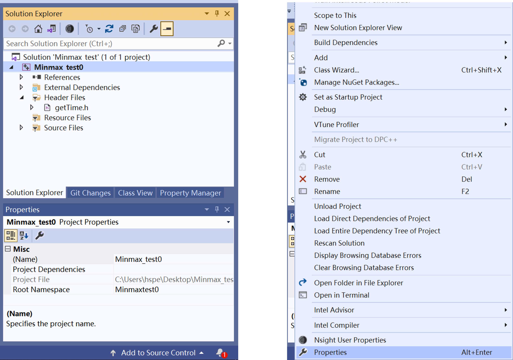
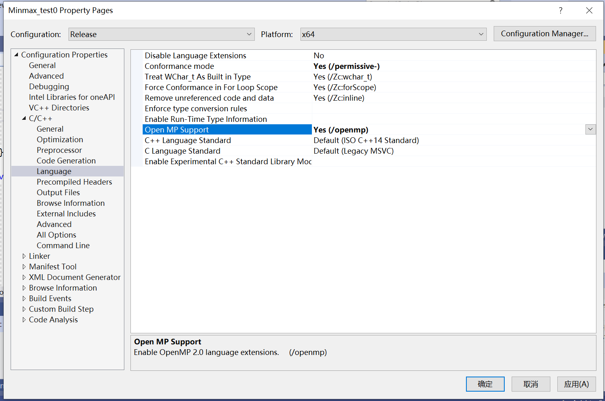
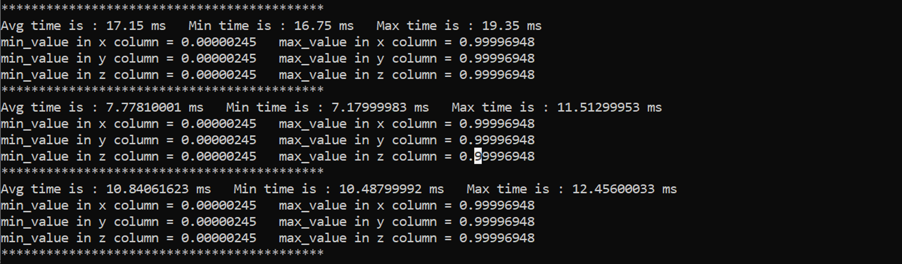
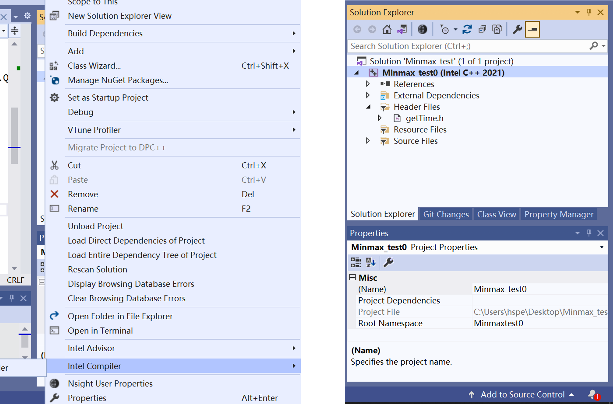
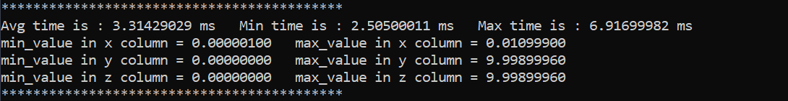
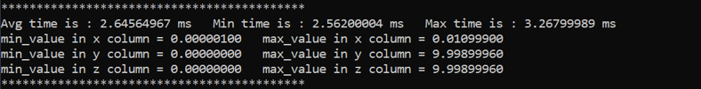

# Optimization Tutorial with OpenMP and Intel Compiler 

## **Introduction**

The sample application implements a basic Minmax function, using the C++ programming languages. This tutorial shows how to improve performance by enabling OpenMP with Intel Compiler in Visual Studio Professional 2019 Version 16.11.15. 

## Initial Minmax() 

Before testing the Minmax(), you need first create a Point struct. It consists of three float numbers to store 3d coordinate value of a Point. Then you can create a vector to store many Points. This is the basic data structure of this tutorial. 

In Minmax function, you can obtain the min/max axis value of all points. In order to unify the function interface, there are some useless parameters for this or later edition of Minmax().

```c++
struct Point {
    float x; float y; float z;
};

vector<Point> mat;

void Minmax(vector<Point>& mat, int rows, int thread, int chunk, float ans[6]) {
	float max_x_element = mat[0].x;
	float max_y_element = mat[0].y;
	float max_z_element = mat[0].z;

	float min_x_element = mat[0].x;
	float min_y_element = mat[0].y;
	float min_z_element = mat[0].z;

	for (int j = 1; j < rows; j++) {
		if (mat[j].x > max_x_element) max_x_element = mat[j].x;
		if (mat[j].y > max_y_element) max_y_element = mat[j].y;
		if (mat[j].z > max_z_element) max_z_element = mat[j].z;

		if (mat[j].x < min_x_element) min_x_element = mat[j].x;
		if (mat[j].y < min_y_element) min_y_element = mat[j].y;
		if (mat[j].z < min_z_element) min_z_element = mat[j].z;
	}

	ans[0] = min_x_element;
	ans[1] = max_x_element;

	ans[2] = min_y_element;
	ans[3] = max_y_element;

	ans[4] = min_z_element;
	ans[5] = max_z_element;
}
```

After creating a random Struct Point Array of 1 000 000 element and then testing it with default release x64 setting, you can see an initial result. All results are under 100 times loop. Then record the minmax values and average values. **Different hardware may have different results.**


**Do nothing to see the runtime**

In fact, using Intel Complier can speed up without doing anything else. Only changing it to Intel Complier make it perform better. 


Compared with default Compiler, you can see a speed-up in this test. [Click here to see how to change the Compiler.](https://www.intel.com/content/www/us/en/develop/documentation/oneapi-dpcpp-cpp-compiler-dev-guide-and-reference/top/compiler-setup/use-microsoft-visual-studio.html) 

---

## **Use OpenMP to optimize**

OpenMP uses pragma to execute parallel programming. Only a few lines of code can make the program run in parallel. Visual Studio 2019 support OpenMP 2.0. So you can easily achieve parallel using the following code. Besides, to avoid read-write conflicts, you can also use other openMP syntax like Atomic .

```C++
void MinMax_OMP1(vector<Point>& mat, int rows, int thread, int chunk, float ans[6]) {
	float max_x_element = mat[0].x;
	float max_y_element = mat[0].y;
	float max_z_element = mat[0].z;

	float min_x_element = mat[0].x;
	float min_y_element = mat[0].y;
	float min_z_element = mat[0].z;

#pragma omp parallel for num_threads(thread)
	for (int j = 1; j < rows; j++) {
		if (mat[j].x > max_x_element)
#pragma omp critical (max_x)
		{
			if (mat[j].x > max_x_element) max_x_element = mat[j].x;
		}
		if (mat[j].y > max_y_element)
#pragma omp critical (max_y)
		{
			if (mat[j].y > max_y_element) max_y_element = mat[j].y;
		}
		if (mat[j].z > max_z_element)
#pragma omp critical (max_z)
		{
			if (mat[j].z > max_z_element) max_z_element = mat[j].z;
		}

		if (mat[j].x < min_x_element)
#pragma omp critical (min_x)
		{
			if (mat[j].x < min_x_element) min_x_element = mat[j].x;
		}
		if (mat[j].y < min_y_element)
#pragma omp critical (min_y)
		{
			if (mat[j].y < min_y_element) min_y_element = mat[j].y;
		}
		if (mat[j].z < min_z_element)
#pragma omp critical (min_z)
		{
			if (mat[j].z < min_z_element) min_z_element = mat[j].z;
		}
	}

	ans[0] = min_x_element;
	ans[1] = max_x_element;

	ans[2] = min_y_element;
	ans[3] = max_y_element;

	ans[4] = min_z_element;
	ans[5] = max_z_element;
}

void Minmax_OMP2(vector<Point>& mat, int rows, int thread, int chunk, float ans[6]) {
	int coreNum = omp_get_num_procs();
	float matrixMinmax[100][6];

	for (int i = 0; i < coreNum; i++)
	{
		matrixMinmax[i][0] = mat[0].x;
		matrixMinmax[i][1] = mat[0].y;
		matrixMinmax[i][2] = mat[0].z;

		matrixMinmax[i][3] = mat[0].x;
		matrixMinmax[i][4] = mat[0].y;
		matrixMinmax[i][5] = mat[0].z;
	}

#pragma omp parallel for num_threads(thread)
	for (int j = 0; j < rows; j++)
	{
		int k = omp_get_thread_num();
		if (mat[j].x > matrixMinmax[k][0]) matrixMinmax[k][0] = mat[j].x;
		if (mat[j].y > matrixMinmax[k][1]) matrixMinmax[k][1] = mat[j].y;
		if (mat[j].z > matrixMinmax[k][2]) matrixMinmax[k][2] = mat[j].z;

		if (mat[j].x < matrixMinmax[k][3]) matrixMinmax[k][3] = mat[j].x;
		if (mat[j].y < matrixMinmax[k][4]) matrixMinmax[k][4] = mat[j].y;
		if (mat[j].z < matrixMinmax[k][5]) matrixMinmax[k][5] = mat[j].z;
	}

	float max_x_element = matrixMinmax[0][0];
	float max_y_element = matrixMinmax[0][1];
	float max_z_element = matrixMinmax[0][2];

	float min_x_element = matrixMinmax[0][3];
	float min_y_element = matrixMinmax[0][4];
	float min_z_element = matrixMinmax[0][5];

	for (int i = 0; i < coreNum; i++) {
		if (matrixMinmax[i][0] > max_x_element) max_x_element = matrixMinmax[i][0];
		if (matrixMinmax[i][1] > max_y_element) max_y_element = matrixMinmax[i][1];
		if (matrixMinmax[i][2] > max_z_element) max_z_element = matrixMinmax[i][2];

		if (matrixMinmax[i][3] < min_x_element) min_x_element = matrixMinmax[i][3];
		if (matrixMinmax[i][4] < min_y_element) min_y_element = matrixMinmax[i][4];
		if (matrixMinmax[i][5] < min_z_element) min_z_element = matrixMinmax[i][5];
	}

	ans[0] = min_x_element;
	ans[1] = max_x_element;

	ans[2] = min_y_element;
	ans[3] = max_y_element;

	ans[4] = min_z_element;
	ans[5] = max_z_element;
}
```





Build the project and test, you can conclude that the openMP version code achieve the acceleration and the results of different implementation may differ. Sometimes bad OpenMP implementation cause worse performance.



## **Use OpenMP and Intel Compiler to optimize**

 **More Advanced Syntax and Fewer Code Changes**

To use openMP syntax min/max reduction, you can switch default complier to Intel Compiler in Visual Studio 2019. [Click here to see how to change the Compiler.](https://www.intel.com/content/www/us/en/develop/documentation/oneapi-dpcpp-cpp-compiler-dev-guide-and-reference/top/compiler-setup/use-microsoft-visual-studio.html) 

Then you should enable OpenMP to make sure compile is all right. You can also enable OpenMP with command lines. [Click here to see the Command-Line Examples.](https://www.intel.com/content/www/us/en/develop/documentation/oneapi-dpcpp-cpp-compiler-dev-guide-and-reference/top/optimization-and-programming/openmp-support/openmp-library-support/use-the-openmp-libraries.html) And you can customize your system environment by specifying paths. [Click here to see more optional changeable OpenMP environment variables.](https://www.intel.com/content/www/us/en/develop/documentation/oneapi-dpcpp-cpp-compiler-dev-guide-and-reference/top/compilation/supported-environment-variables.html#supported-environment-variables)

For this function, now it's a just one line code change to achieve parallel.

```c++
void MinMAX_OMP3(vector<Point>& mat, int rows, int thread, int chunk, float ans[6]) {
	float max_x_element = mat[0].x;
	float max_y_element = mat[0].y;
	float max_z_element = mat[0].z;

	float min_x_element = mat[0].x;
	float min_y_element = mat[0].y;
	float min_z_element = mat[0].z;

#pragma omp parallel for num_threads(thread) reduction(max:max_x_element,max_y_element,max_z_element) reduction(min:min_x_element,min_y_element,min_z_element )
	for (int j = 1; j < rows; j++) {
		if (mat[j].x > max_x_element) max_x_element = mat[j].x; 
		if (mat[j].y > max_y_element) max_y_element = mat[j].y; 
		if (mat[j].z > max_z_element) max_z_element = mat[j].z;

		if (mat[j].x < min_x_element) min_x_element = mat[j].x;
		if (mat[j].y < min_y_element) min_y_element = mat[j].y;
		if (mat[j].z < min_z_element) min_z_element = mat[j].z;
	}

	ans[0] = min_x_element;
	ans[1] = max_x_element;

	ans[2] = min_y_element;
	ans[3] = max_y_element;

	ans[4] = min_z_element;
	ans[5] = max_z_element;
}
```





Rebuild and run the process, the runtime now is much less than just now. 

## **Use Dynamic to stabilize**

In fact, you can observe that the max runtime can cost up to 3 times for last OpenMP version code. One way to solve this question is to use OpenMP syntax dynamic.

```C++
void MinMAX_OMP3(vector<Point>& mat, int rows, int thread, int chunk, float ans[6]) {
	float max_x_element = mat[0].x;
	float max_y_element = mat[0].y;
	float max_z_element = mat[0].z;

	float min_x_element = mat[0].x;
	float min_y_element = mat[0].y;
	float min_z_element = mat[0].z;

#pragma omp parallel for num_threads(thread) schedule(dynamic,chunk) reduction(max:max_x_element,max_y_element,max_z_element) reduction(min:min_x_element,min_y_element,min_z_element )
	for (int j = 1; j < rows; j++) {
		if (mat[j].x > max_x_element) max_x_element = mat[j].x; 
		if (mat[j].y > max_y_element) max_y_element = mat[j].y; 
		if (mat[j].z > max_z_element) max_z_element = mat[j].z;

		if (mat[j].x < min_x_element) min_x_element = mat[j].x;
		if (mat[j].y < min_y_element) min_y_element = mat[j].y;
		if (mat[j].z < min_z_element) min_z_element = mat[j].z;
	}

	ans[0] = min_x_element;
	ans[1] = max_x_element;

	ans[2] = min_y_element;
	ans[3] = max_y_element;

	ans[4] = min_z_element;
	ans[5] = max_z_element;
}
```

You can see the average runtime and max runtime in the following picture.



 In general, the performance has been greatly improved after using Intel compiler and enable OpenMP.

## Notes: 

1. You need accurate and precise timing tools. Please see the reference code.

2. When calculating in such a small time, you need to consider the effects of various factors carefully. For example, function should pass by reference instead of by value. 

3. Complier sometimes may be too intelligent. When it find out some calculation is not necessary, it just skip that part. If this happen, make sure the calculation part is necessary.