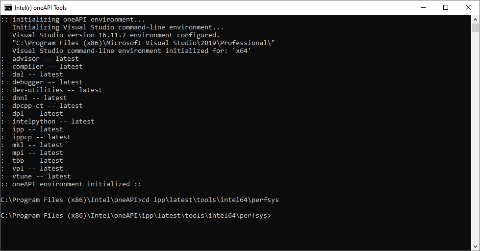
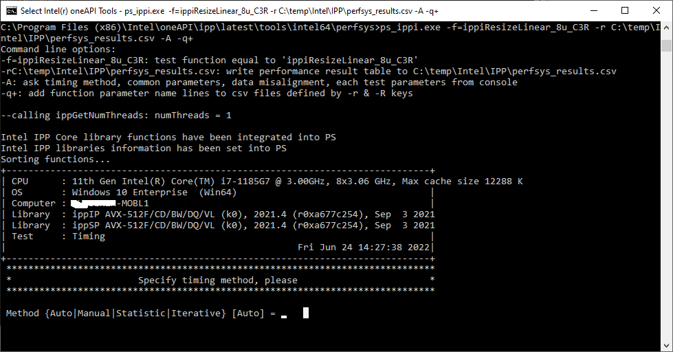
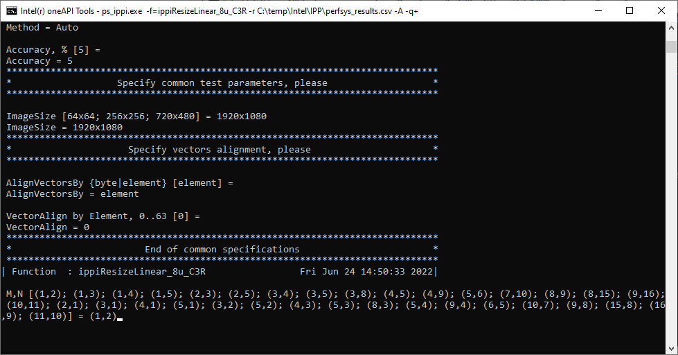
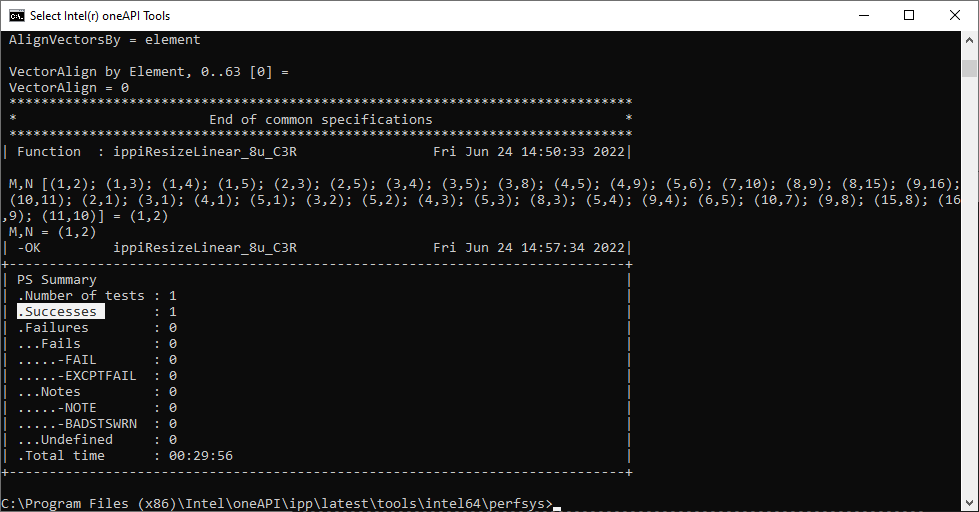
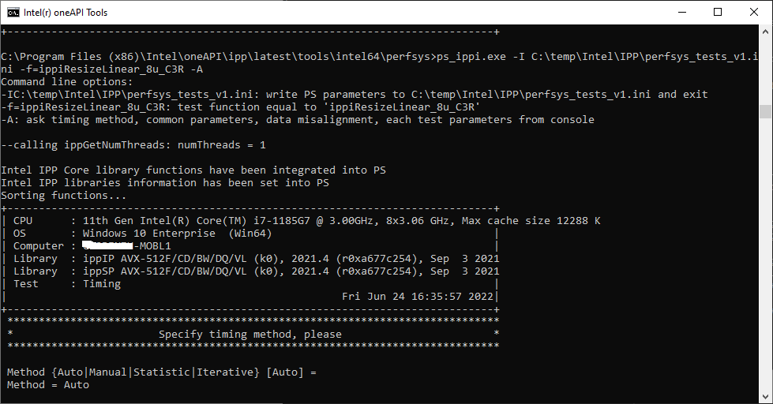
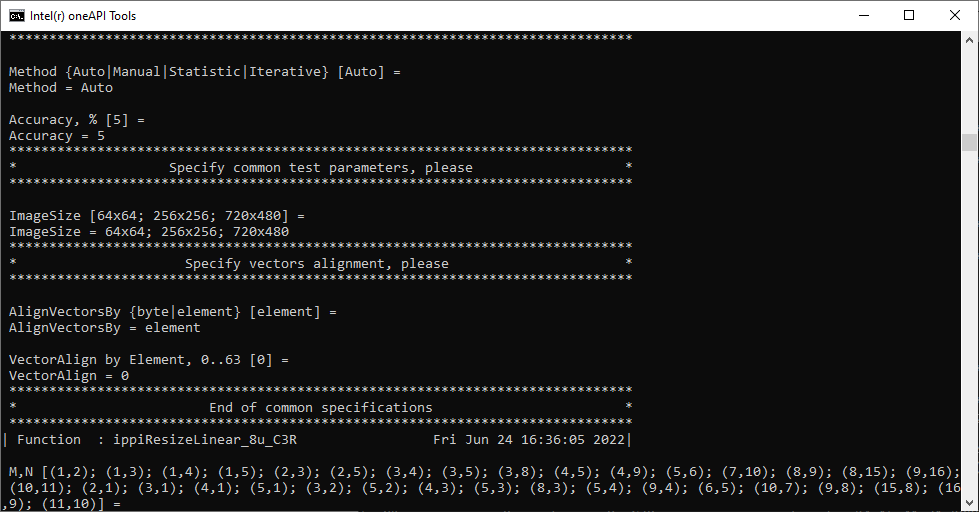
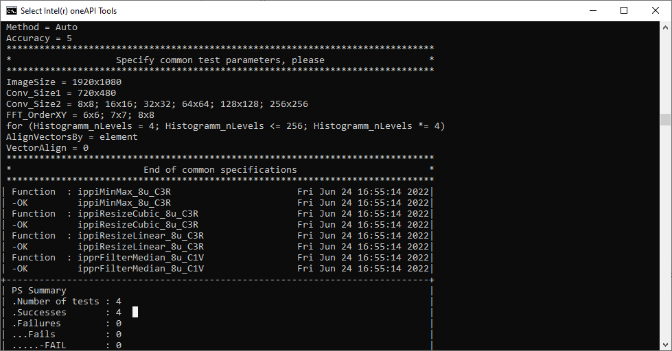

# Tool to Measure Performance of Intel IPP Functions 

## **Introduction**

Intel® Integrated Performance Primitives (Intel® IPP) installation includes command-line tools for performance testing in the <install_dir>/tools/perfsys directory. There is one perfsys tool for each domain. For example, ps_ippi executable measures performance for all Intel IPP image processing domain functions.

Many factors may affect Intel IPP performance. One of the best way to understand them is to run multiple tests in the specific environment you are targeting for optimization. The purpose of the perfsys tools is to simplify performance experiments and empower developers with useful information to get the best performance from Intel IPP functions.

With the command-line options you can:

- Create a list of functions to test
- Set parameters for each function
- Set image/buffer sizes

To simplify re-running specific tests, you can define the functions and parameters in the initialization file, or enter them directly from the console.

## **Environment Setup**

[Install oneAPI Base Toolkit](../../README.md)

## **Example to Test Performance of one Intel IPP Function**

1. Launch Windows Command Line

   > *Windows Start > Intel oneAPI 2022 > Intel oneAPI command prompt for Intel 64 for Visual Studio 2019*

   

2. Change directory to <install_dir>/tools/perfsys directory

   ```bash
   cd ipp\latest\tools\intel64\perfsys
   ```

   

3. Test performance of one Intel IPP function *`ippiResizeLinear_8u_C3R`* with *`ps_ippi.exe`* command with below options

    `-f=ippiResizeLinear_8u_C3R`:	Runs test for function with pattern full name.

   `-r C:\temp\Intel\IPP\perfsys_results.csv`:	Create C:\temp\Intel\IPP\perfsys_results.csv file and write perfsys results to it.

   `-A` :	Prompt for the parameters before every test from console

   `-q+`:	Add function parameter name lines to perfsys results table file

   

4. Press `enter` to use default method `Auto` continue

   `Auto`:  This method repeats some times and the best result is printed. These test repetitions are necessary to avoid casual fluctuations generated by the system.

   `Statistical`:	Each function is measured at least NumCalls times, and the measurements continue until the total number of processor clocks exceeds the specified value of TotalClocks. The result is the average taken across all measurements.

5. Press `enter` to use default value for required accuracy to continue.

6. Input the `ImageSize` you are interested in, `1920x1080` in this example.

7. Press `enter` to use default value for `AlignVectorBy` and `VectorAlign` to continue.

8. Input `(1,2)` for `M,N` parameters of *`ippiResizeLinear_8u_C3R`*

   

9. Press `enter` to run the test with successful execution like this.

   

10. Performance data of *`ippiResizeLinear_8u_C3R`* can be found in C:\temp\Intel\IPP\perfsys_results.csv

    > CPU,11th Gen Intel(R) Core(TM) i7-1185G7 @ 3.00GHz, 8x3.06 GHz, Max cache size 12288 K
    > OS,Windows 10 Enterprise  (Win64)
    > Computer,xxx-MOBL1
    > Library,ippIP AVX-512F/CD/BW/DQ/VL (k0), 2021.4 (r0xa677c254), Sep  3 2021
    > Library,ippSP AVX-512F/CD/BW/DQ/VL (k0), 2021.4 (r0xa677c254), Sep  3 2021
    > Start,Fri Jun 24 14:27:38 2022
    > ***function***,Parm1,Parm2,Parm3,Parm4,Parm5,Parm6,Parm7,Parm8,Comment,Clocks,per,***<u>Time (usec)</u>***,MFlops
    > ippiResizeLinear,8u,C3R,***dstSize***,***srcSize***,***M***,***N***,-,-,parmNames,-,-,-,-
    > ***ippiResizeLinear***,8u,C3R,***1920x1080***,***3840x2160***,1,2,-,-,nLps=8,1.56,pxch,***<u>3.18e+03</u>***,-

11. [The perfsys result file](res/perfsys_results.csv) is available to check too.

## Example to Test Performance of a list of Intel IPP Functions

1. Generate perfsys parameters in the initialization file <file-name>.ini

   ```bash
   ps_ippi.exe -I C:\temp\Intel\IPP\perfsys_tests_v1.ini -f=ippiResizeLinear_8u_C3R -A
   ```

   

2. Press `enter` to select default test configurations for perfsys like previous example.

   

3. The 1st version of initialization file for perfsys test is generated like this

   ```
   [Perf System]
   Method=Auto	// Auto|Manual|Statistic|Iterative
   Accuracy=5
   ImageSize=64x64; 256x256; 720x480
   AlignVectorsBy=element	// byte|element
   VectorAlign=0
   
   [ippiResizeLinear_8u_C3R]
   M,N=(1,2); (1,3); (1,4); (1,5); (2,3); (2,5); (3,4); (3,5); (3,8); (4,5); (4,9); (5,6); (7,10); (8,9); (8,15); (9,16); (10,11); (2,1); (3,1); (4,1); (5,1); (3,2); (5,2); (4,3); (5,3); (8,3); (5,4); (9,4); (6,5); (10,7); (9,8); (15,8); (16,9); (11,10)
   ```

   

4. [The 1st version of generated .ini file](res/perfsys_tests_v1.ini) is available to check too.

5. Generate more parameters for perfsys test with below command, press `enter` to use all default configurations

   ```bash
   ps_ippi.exe -i C:\temp\Intel\IPP\perfsys_tests_v1.ini  -P -I C:\temp\Intel\IPP\perfsys_tests_v2.ini
   ```

   `-i C:\temp\Intel\IPP\perfsys_tests_v1.ini` :	Read perfsys parameters from the file <file-name>.ini

   `-P`:	Read tested function names from the .ini file

   

   The 2nd version of initialization file is generated like below：

   ```
   [Perf System]
   avoidFFT=yes
   numIter=1; 2; *5
   kerSize=3; 11; +2
   filterType=Gauss	// Gauss
   distMethodType=NormL1	// NormL1
   stage=InMem; Const; Repl	// InMem|Const|Repl
   kernel=ipp16s; ipp32f	// ipp16s|ipp32f|ipp64f
   normType=NormL1; NormL2	// NormL1|NormL2
   norm= ; L1; L2	//  |L1|L2
   Method=Auto	// Auto|Manual|Statistic|Iterative
   Accuracy=5
   ImageSize=64x64; 256x256; 720x480
   Conv_Size1=720x480
   Conv_Size2=8x8; 16x16; 32x32; 64x64; 128x128; 256x256
   FFT_OrderXY=6x6; 7x7; 8x8
   Histogramm_nLevels=4; 256; *4
   AlignVectorsBy=element	// byte|element
   VectorAlign=0
   ```

   

6. [The 2nd version of generated .ini file](res/perfsys_tests_v2.ini) is available to check too.

7. Update ImageSize per your interest and add four Intel IPP functions like this

   ```
   [Perf System]
   avoidFFT=yes
   numIter=1; 2; *5
   kerSize=3; 11; +2
   filterType=Gauss
   distMethodType=NormL1
   stage=InMem; Const; Repl
   kernel=ipp16s; ipp32f
   normType=NormL1; NormL2
   norm=; L1; L2
   Method=Auto
   Accuracy=5
   ImageSize=1920x1080	// 64x64; 256x256; 720x480
   Conv_Size1=720x480
   Conv_Size2=8x8; 16x16; 32x32; 64x64; 128x128; 256x256
   FFT_OrderXY=6x6; 7x7; 8x8
   Histogramm_nLevels=4; 256; *4
   AlignVectorsBy=element
   VectorAlign=0
   
   [ippiResizeLinear_8u_C3R]
   M,N=(1,2)
   
   [ippiResizeCubic_8u_C3R]
   M,N=(1,2)
   
   [ipprFilterMedian_8u_C1V]
   stage=InMem
   volume=256x256x256
   maskVolume=3x3x3
   
   [ippiMinMax_8u_C3R]
   
   ```

   

8. [The final version of .ini file](res/perfsys_tests_v3.ini) is available to check too.

9. Run performance test for these four Intel IPP Functions with below command

   ```bash
   ps_ippi.exe -i C:\temp\Intel\IPP\perfsys_tests_v3.ini  -P -r C:\temp\Intel\IPP\perfsys_results_2.csv -q+
   ```

   

10. Test results can be found in C:\temp\Intel\IPP\perfsys_results_2.csv

    > CPU,11th Gen Intel(R) Core(TM) i7-1185G7 @ 3.00GHz, 8x3.06 GHz, Max cache size 12288 K
    > OS,Windows 10 Enterprise  (Win64)
    > Computer,xxx-MOBL1
    > Library,ippIP AVX-512F/CD/BW/DQ/VL (k0), 2021.4 (r0xa677c254), Sep  3 2021
    > Library,ippSP AVX-512F/CD/BW/DQ/VL (k0), 2021.4 (r0xa677c254), Sep  3 2021
    > Start,Fri Jun 24 17:04:36 2022
    > function,Parm1,Parm2,Parm3,Parm4,Parm5,Parm6,Parm7,Parm8,Comment,Clocks,per,Time (usec),MFlops
    > ippiMinMax,8u,C3R,ImageSize,-,-,-,-,-,parmNames,-,-,-,-
    > ippiMinMax,8u,C3R,1920x1080,-,-,-,-,-,nLps=54,0.0891,pxch,181,-
    > ippiResizeCubic,8u,C3R,dstSize,srcSize,M,N,-,-,parmNames,-,-,-,-
    > ippiResizeCubic,8u,C3R,1920x1080,3840x2160,1,2,-,-,nLps=8,2.71,pxch,5.51e+03,-
    > ippiResizeLinear,8u,C3R,dstSize,srcSize,M,N,-,-,parmNames,-,-,-,-
    > ippiResizeLinear,8u,C3R,1920x1080,3840x2160,1,2,-,-,nLps=8,1.59,pxch,3.23e+03,-
    > ipprFilterMedian,8u,C1V,volume,maskVolume,-,-,-,-,parmNames,-,-,-,-
    > ipprFilterMedian,8u,C1V,256x256x256,InMem,3x3x3,-,-,-,nLps=8,6.66,pxch,3.65e+04,-

11. [The perfsys result file](res/perfsys_results_2.csv) is available to check too.

---

More information on [Performance Test Tool (perfsys) Command Line Options](https://www.intel.com/content/www/us/en/develop/documentation/dev-guide-ipp-for-oneapi/top/perf-test-tool.html).


