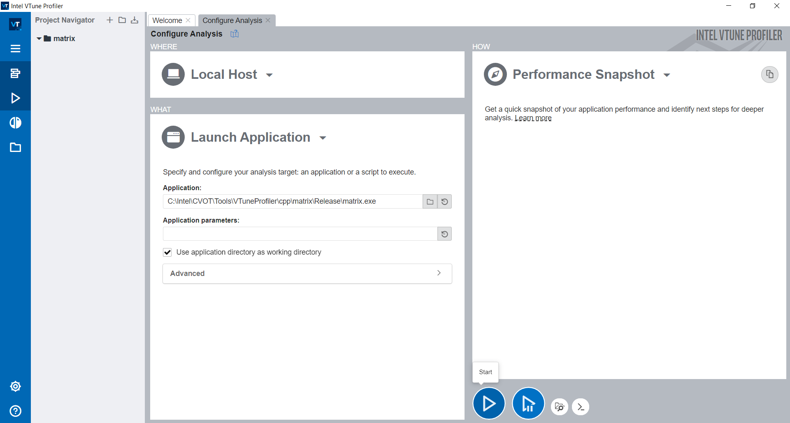
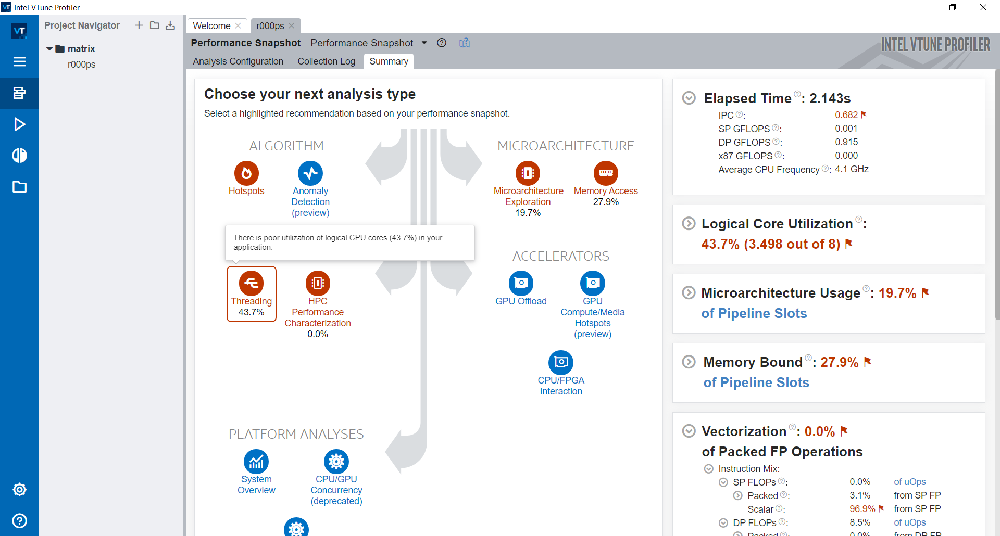
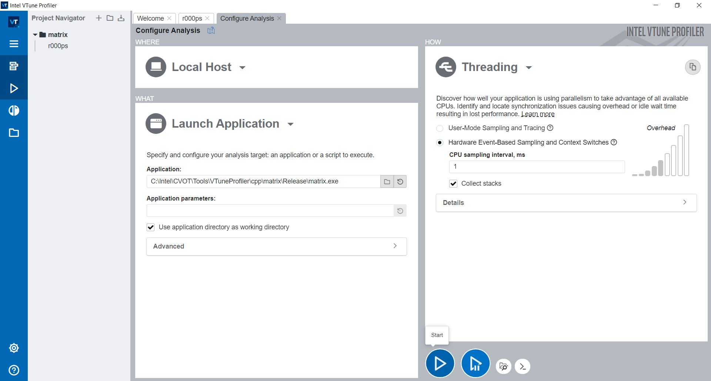
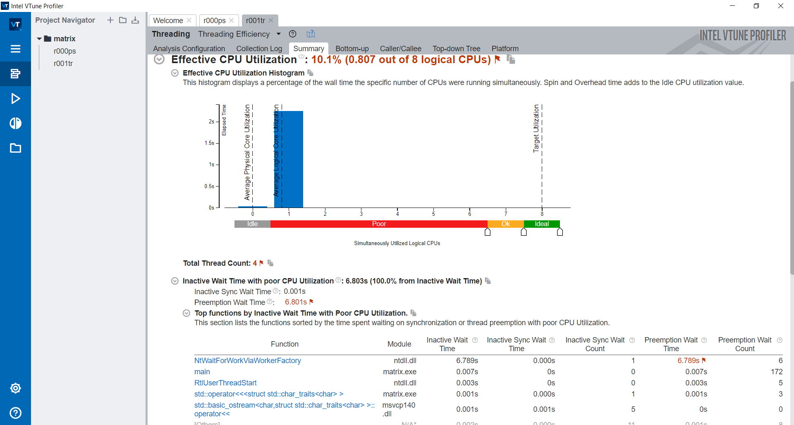
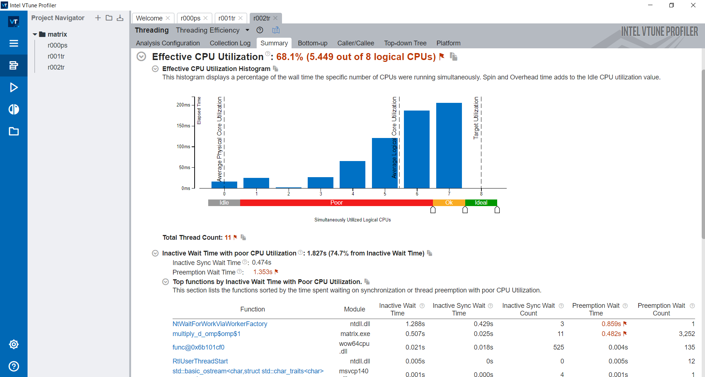
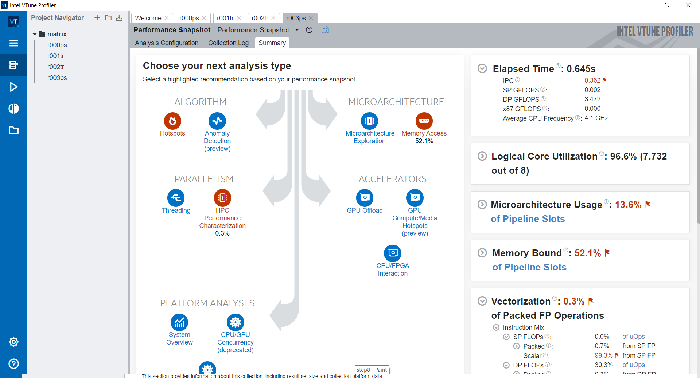

# **Threading Optimization Tutorial with Intel VTune Profiler**

## **Introduction**

The sample application implements a basic Matrix multiplication, using the C++ programming language. This guide explains how use Intel VTune Profiler to identify the main problem areas, analyze and interpret CPU threading efficiency,  and analyze performance after optimization.

## **Environment Setup**

[Install Intel VTune Profiler](https://www.intel.com/content/www/us/en/develop/documentation/vtune-help/top/installation.html)

## **Run Performance Snapshot Analysis**

In this part of the tutorial, you open the Matrix sample project and run the Performance Snapshot analysis of Intel VTune Profiler to identify the main problem areas.

**Performance Snapshot Analysis**
For most software developers, the goal of performance optimization is to get the highest possible performance gain with the least possible investment of time and effort.
The Performance Snapshot analysis type helps you achieve this goal by highlighting the main problem areas in your application and providing metrics to estimate their severity. This enables you to focus on the most acute problems, solving which can yield the highest performance gain. This analysis type also offers other analysis types for deeper investigation into each performance problem.

**Launch VTune Profiler GUI and Create a New Project**
The first step towards analyzing an application in VTune Profiler is to create a project. A project is a container that holds analysis target configuration and data collection results.

---

**NOTE:**

- You may need to run VTune Profiler as **Administrator** to use certain analysis types.
- When you analyze your own application, make sure to build it in the Release mode with full optimizations and establish a performance baseline before running a full analysis. 
- To make sure that the performance data is accurate and repeatable, it is recommended to run the analysis while the system is running a minimal amount of other software.

---

**Run Performance Snapshot Analysis**

Click the **Start** button to start the Performance Snapshot analysis for the matrix sample application.

VTune Profiler the matrix application that calculates multiplication of large matrices before exiting. VTune Profiler finalizes the collected results and opens the **Summary** viewpoint of the Performance Snapshot analysis.

## Interpret Performance Snapshot Result Data

At this point in the Tutorial, interpret the Performance Snapshot analysis result to identify main problem areas in the application.
When the sample application exits, Intel VTune Profiler finalizes the result and opens the Summary tab of the Performance Snapshot analysis result.

**Understand the Performance Snapshot Summary Tab**

The Performance Snapshot result **Summary** tab shows the following:

- **Analysis tree:** Performance Snapshot offers other analysis types that may be useful for a deeper investigation into the performance issues found in your application. Analysis types that are related to performance problems detected in your application are highlighted in *red*.
  You can estimate the severity of each problem by studying the metric values.
  Hover over an analysis type icon to understand how an analysis type is related to your performance problem.

- **Metrics Panes:** these panes show the high-level metrics that contribute most to estimating application performance. Problematic areas are highlighted in *red*. You can expand each pane to get more information on each problem area and to see the lower-level metrics that contributed to the verdict.
  Hover over each metric to see the metric description.

**Identify Problem Areas**

In this case, observe these main indicators that highlight the performance bottlenecks:

- The **Logical Core Utilization** metric is low, indicating a poor logical CPU cores utilization problem. Due to this, Performance Snapshot highlights the **Threading** analysis as a potential starting point and indicates that this performance bottleneck contributes meaningful amount to the total **Elapsed Time**.
- The **Vectorization** metric value is equal to 0.0%, which means that the code was not vectorized. Due to this, Performance Snapshot highlights the HPC Performance Characterization analysis as another potential analysis direction.

In this tutorial, vectorization optimization is not covered. 

Next step, to run the **Threading Analysis** from the Performance Snapshot **Summary** window, click the **Threading** icon in the **Analysis tree**, the **Configure Analysis** window opens.

.

## Run and Interpret Threading Analysis

Use the Threading analysis to identify how efficiently an application uses available processor compute cores and explore inefficiencies in threading runtime usage or contention on threading synchronization that makes threads waiting and prevents effective processor utilization.

Intel VTune Profiler uses the Effective CPU Utilization metric as a main measurement of threading efficiency. The metric is built on how an application utilizes the available logical cores. 

**Configure and Start Threading Analysis**

The Threading Analysis provides two collection modes with major differences in thread wait time collection and interpretation:

- [User-Mode Sampling and Tracing](https://www.intel.com/content/www/us/en/develop/documentation/vtune-help/top/analyze-performance/parallelism-analysis-group/threading-analysis.html#threading-analysis_TRACINGMODE), which can recognize synchronization objects and collect thread wait time by objects using tracing. This is helpful in understanding thread interaction semantics and making optimization changes based on that data. There are two groups of synchronization objects supported by Intel VTune Profiler: objects usually used for synchronization between threads (such as Mutex or Semaphore) and objects associated with waits on I/O operations (such as Stream).
- [Hardware Event-Based Sampling and Context Switches](https://www.intel.com/content/www/us/en/develop/documentation/vtune-help/top/analyze-performance/parallelism-analysis-group/threading-analysis.html#threading-analysis_HARDWAREMODE), which collects thread inactive wait time based on context switch information. Even though there is not a thread object definition in this case, the problematic synchronization functions can be found by using the wait time attributed with call stacks with lower overhead than the previous collection mode. The analysis based on context switches also shows thread preemption time, which is useful in measuring the impact of thread oversubscription on a system.

---

**NOTE:**

Hardware Event-Based Sampling and Context Switches mode is configured in this tutorial.

---

**View Data**

Start on the result **Summary** window to explore the Effective CPU utilization of your application and identify reasons for underutilization connected with synchronization, parallel work arrangement overhead, or incorrect thread count. Click links associated with flagged issues to be taken to more detailed information. 

The following indicator of Threading Analysis provide the reasons for poor CPU utilization:
**Effective CPU Utilization Histogram:** on average, only one logical CPU Core is simultaneously utilized by the sample application. 

A good way to resolve this issue is to parallelize the *multiply_d* with OpenMP multi-threading support, thus the application can utilize all the logical CPU Cores.

In the *matrix_serial_omp.cpp* source file, comment out *line 150*:

  `//multiply_d(num, aMatrix, bMatrix, product);`

uncomment *line 151*:

  `multiply_d_omp(num, aMatrix, bMatrix, product);`

This changes the program to multi-threaded implementation.

Build the project and analyze performance after optimization.

---

**NOTE:**

Follow [these steps](https://docs.microsoft.com/en-us/cpp/build/reference/openmp-enable-openmp-2-0-support?view=msvc-170#to-set-this-compiler-option-in-the-visual-studio-development-environment) to enable OpenMP support in Visual Studio

---

## Analyze Performance After Optimization

In this step, run the Threading analysis again to profile the application with OpenMP multi-threading enabled.
To see the improvement provided by using the multi-threading technique, run the Threading analysis again.

Once the sample application finishes, the Threading analysis Summary window opens.

Observe the improvement of effective CPU utilization, from 10.1% to 68.1%.

By running the sample application in console, the CPU time of multiply_d is reduced to 0.552 seconds from 1.21 seconds.

To identify the next problem area to do further optimization, run the Performance Snapshot analysis again to profile the application with OpenMP multi-threading enabled.

**Run the Performance Snapshot analysis again**

**Identify Problem Areas**
In this case, observe these main indicators that highlight the performance bottlenecks:

- The **Memory Bound** metric is high, indicating a memory access problem. Due to this, Performance Snapshot highlights the **Memory Access** analysis as a potential starting point.
- The **Vectorization** metric value is equal to 0.3%, which means that the code was not vectorized. Due to this, Performance Snapshot highlights the **HPC Performance Characterization** analysis as another potential analysis direction.

See [more step-by-step instructions](https://www.intel.com/content/www/us/en/develop/documentation/vtune-help/top/introduction/tutorials-and-samples.html) on further performance analysis.

