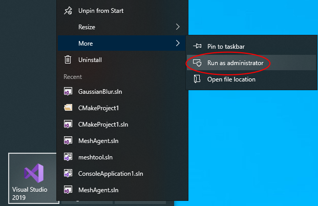
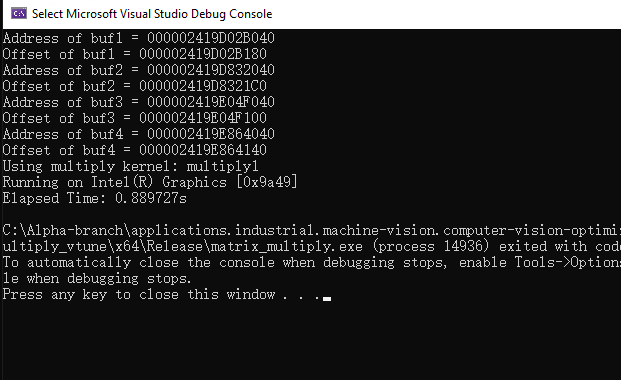
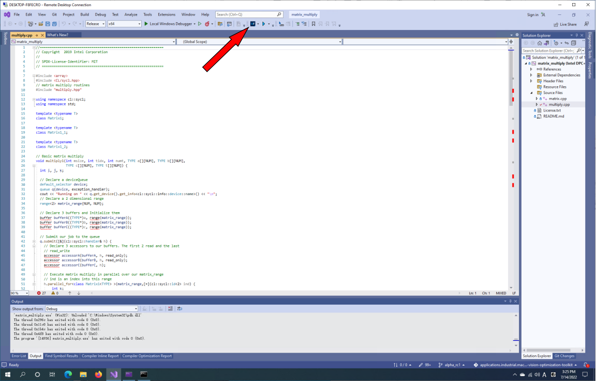
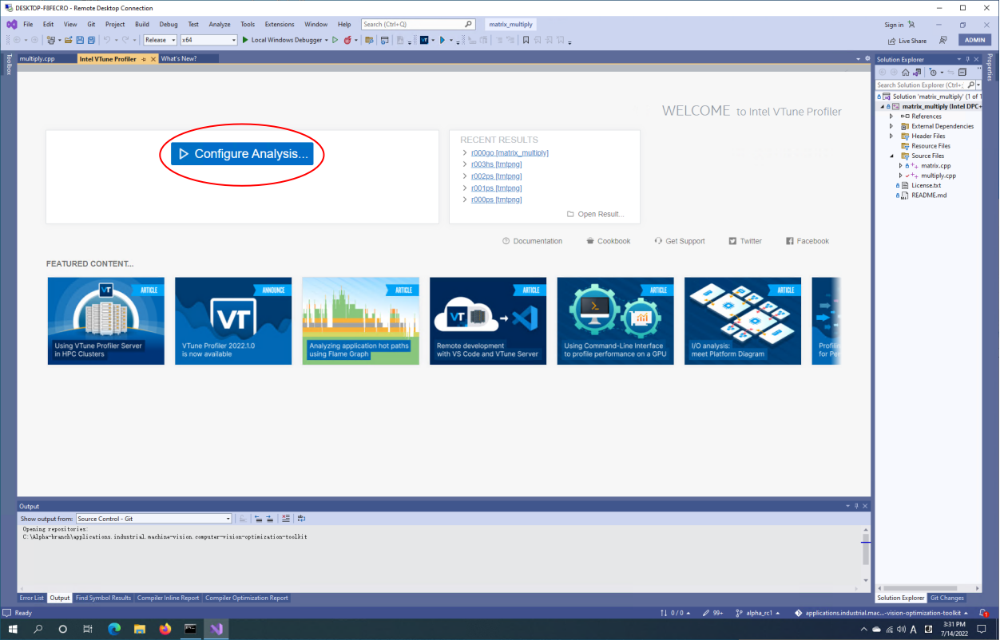
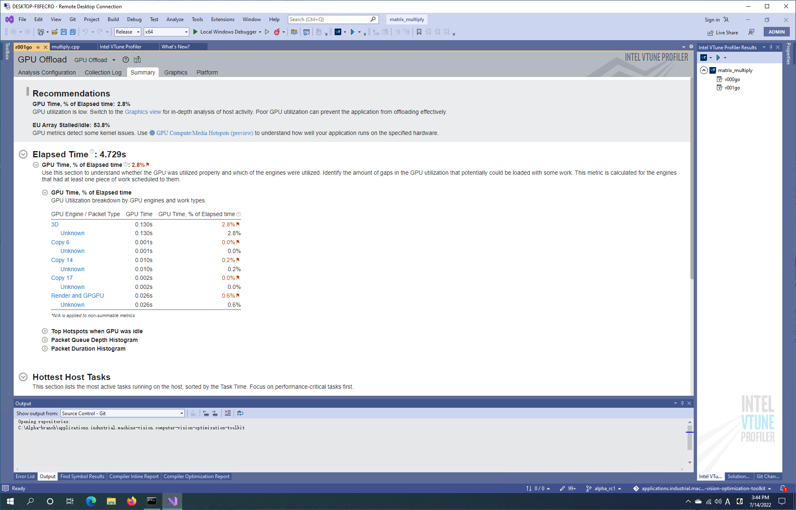
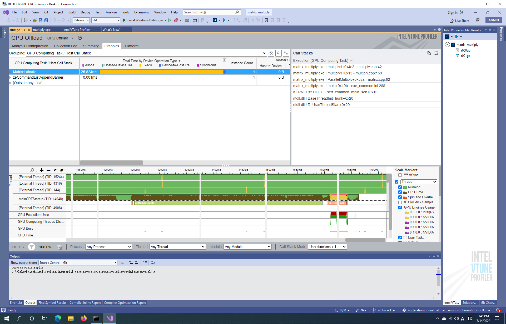

# `Matrix Multiply` Sample
A sample containing multiple implementations of matrix multiplication. This sample code is implemented using DPC++ language for CPU and GPU. 
  
| Optimized for                       | Description
|:---                               |:---
| OS                                | Linux Ubuntu 18.04; Windows 10
| Hardware                          | Kaby Lake with GEN9 or newer
| Software                          | Intel&reg; oneAPI DPC++ Compiler; VTune(TM) Profiler
| What you will learn               | How to profile an application using Intel&reg; VTune(TM) Profiler
| Time to complete                  | 15 minutes

## Purpose

The Matrix Multiplication sample performs basic matrix multiplication. Three version are provided that use different features of DPC++.

## Key Implementation details

The basic DPC++ implementation explained in the code includes device selector, buffer, accessor, kernel, and command groups. 
Include Files
The include folder is located at %ONEAPI_ROOT%\dev-utilities\latest\include on your development system.

## License  
Code samples are licensed under the MIT license. See
[License.txt](https://github.com/oneapi-src/oneAPI-samples/blob/master/License.txt) for details.

Third party program Licenses can be found here: [third-party-programs.txt](https://github.com/oneapi-src/oneAPI-samples/blob/master/third-party-programs.txt)

## How to Build  

This sample contains 3 version of matrix multiplication using DPC++:

    multiply1 – basic implementation of matrix multiply using DPC++
    multiply1_1 – basic implementation that replaces the buffer store with a local accessor “acc” to reduce memory traffic
    multiply1_2 – basic implementation plus the local accessor and matrix tiling

Edit the line in multiply.h to select the version of the multiply function:
#define MULTIPLY multiply1

### On a Linux* System
	To build DPC++ version:
	cd <sample dir>
	cmake .
	make 

    Clean the program  
    make clean  

### On a Windows* System Using Visual Studio 2017 or newer
   * Open Visual Studio 2017
   * Select Menu "File > Open > Project/Solution", find "matrix_multiply" folder and select "matrix_multiply.sln"
   * Select Menu "Project > Build" to build the selected configuration
   * Select Menu "Debug > Start Without Debugging" to run the program

### on Windows - command line - Build the program using MSBuild
    DPCPP Configurations:
    Release - MSBuild matrix_multiply.sln /t:Rebuild /p:Configuration="Release"
    Debug - MSBuild matrix_multiply.sln /t:Rebuild /p:Configuration="Debug"

## Example of Output
   ./matrix.dpcpp 

   Using multiply kernel: multiply1 

   Running on Intel(R) Gen9

   Elapsed Time: 0.539631s

## Running an Intel VTune Profiler analysis
------------------------------------------

vtune -collect gpu-hotspots -- ./matrix.dpcpp

## Running Inter VTune Profiler on windows

**Launch Visual Studio with Adminstrator**

**Compile this project**

open matrix_multiply.sln and compile it, you can check the output by running it. the result would be as follows:

**Open the Vtune Profiler**

If you successfully installed the oneapi toolkit, you can find vtune embeded in the visual studio toolkit. You can just click the Vtune Profiler button.

**Click the configure analysis**

**Click the snapshot**

**Choose gpu offload in the performance analysis tree**

**After click start, gpu offload summary will show up**

Run the GPU Offload Analysis in VTune Profiler to identify if your application is CPU or GPU-bound. You can also see how effectively the application offloads code to the GPU. Use analysis results and data transfer metrics to identify:

- Whether your application is CPU or GPU-bound. If your application is CPU-bound, follow guidance from the analysis to improve GPU offload and make your application GPU-bound.
- Whether your offload onto the GPU is optimal.
- GPU kernels that are critical for performance and require optimization.

**Check gpu offload graphics tab**

- The analysis summary displays execution time as well as data transfer time. If the execution time is lower, this indicates a sub-optimal offload schema for your application.
- Depending on the grouping level that you select, the Graphics tab presents the collected data in different views:
    - The Function/Call Stack grouping level displaysthe hottest functions that executed on the CPU when the GPU was idle.
    - The Computing Task grouping level displays a breakdown of total processing time for computing task per kernel as well as the size of data transfer. 

## Learn more

See  
[Optimize Applications for Intel® GPUs with Intel® VTune™ Profiler](https://www.intel.cn/content/www/cn/zh/developer/articles/technical/optimize-applications-for-intel-gpus-with-intel-vtune-profiler.html)

[Window: Graphics - GPU Compute/Media Hotspots](https://www.intel.com/content/www/us/en/develop/documentation/vtune-help/top/reference/user-interface-reference/window-graphics-gpu-compute-media-hotspots.html)

