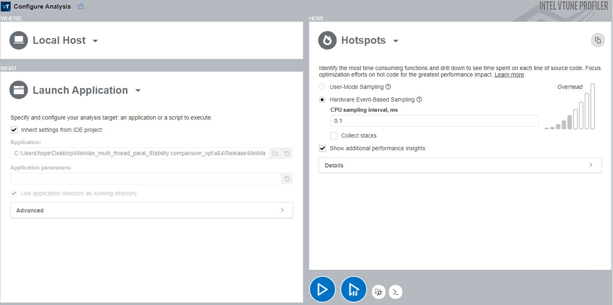
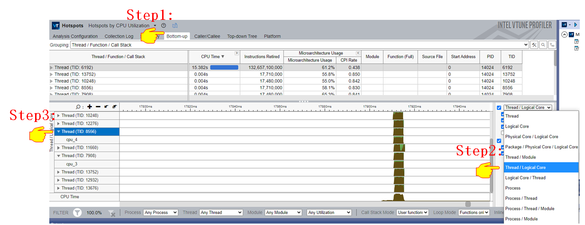
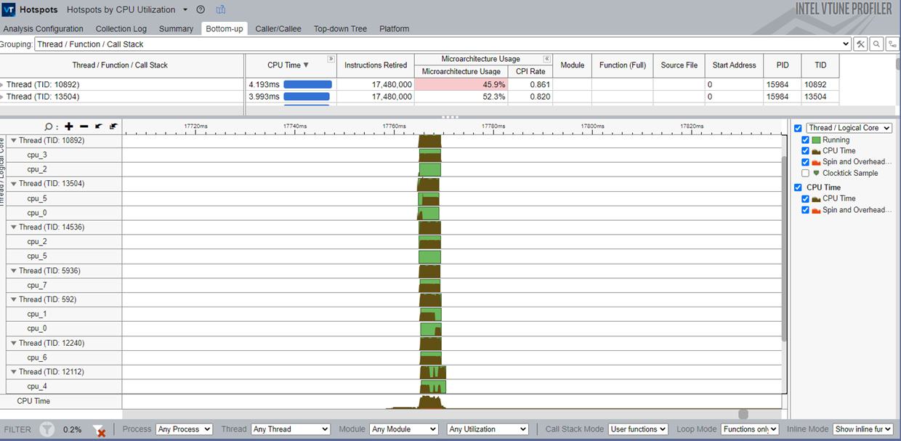
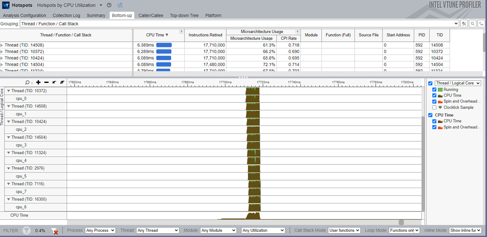
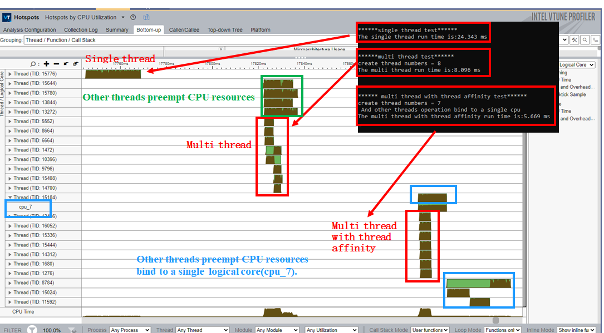

# **Analyze the performance of setting thread affinity and thread priority in the VTune Profiler**

## **Introduction**

This tutorial shows how to improve performance by setting thread affinity and thread priority with a sample project.

The result are verified on Intel platform Intel(R) Core(TM) i5-8259U, for detail, please refer to https://ark.intel.com/content/www/us/en/ark/products/135935/intel-core-i58259u-processor-6m-cache-up-to-3-80-ghz.html.

## **Environment Setup**

[Install Intel VTune Profiler](https://www.intel.com/content/www/us/en/develop/documentation/vtune-help/top/installation.html)

## **Run Hotspots Analysis**

In this part of the tutorial, you build the sample project in Visual Studio and run the Hotspots analysis of Intel VTune Profiler.

**Launch VTune Profiler GUI and Create a New Project**
The first step towards analyzing an application in VTune Profiler is to create a project. A project is a container that holds analysis target configuration and data collection results.

---

**NOTE:**

- You may need to run VTune Profiler as **Administrator** to use certain analysis types.
- When you analyze your own application, make sure to build it in the **Release** mode with full optimizations and establish a performance baseline before running a full analysis. 
- To make sure that the performance data is accurate and repeatable, it is recommended to run the analysis while the system is running a minimal amount of other software.

---

**Run Performance Hotspots Analysis**

Click the **Start** button to start the Hotspots analysis for the sample application.

VTune Profiler finalizes the collected results and opens the **Summary** viewpoint of the Hotspots analysis.

## How to identify thread migration among different cores

1. Open **Bottom-up** Tab of the Hotspots Analysis Result.
2. Select **Thread/Logical Core**.
3. Click on the **Thread** on the left panel to view which core the thread is running on.

**Thread affinity binds threads to run on specified logical cores**

1. Without thread affinity: Threads are allocated by the system and run irregularly on logical cores.

   

2. With thread affinity:  Threads run on the specified logical core(CPU_0 to CPU_7).

**NOTE:**

- Use **SetThreadAffinityMask()** function to set thread affinity.

##  How to check whether thread affinity has taken effect

1. With multi-thread parallel computing, it will drastically reduce the time to get the max and min values.
2. With thread affinity, it takes less time to get the maximum and minimum values.

---

**NOTE:**

- There are eight threads running the function to get the maximum and minimum values in parallel, and you can find the runtime of multi-thread will be shorter than that of a single thread.
- When eight threads run the function in parallel,  there are some other threads that preempt CPU resources. You can manually create seven threads, bound to seven of the eight CPU cores for parallel processing acceleration, leaving one core for other threads to avoid large performance fluctuations caused by resource competition.

---

## Add thread priority to enhance Performance Stability

In this tutorial, we set thread priority for the program after setting thread affinity above. In this way, you can enhance performance stability. 

**NOTE:**

- Use **SetThreadPriority()** function to set thread priority.

