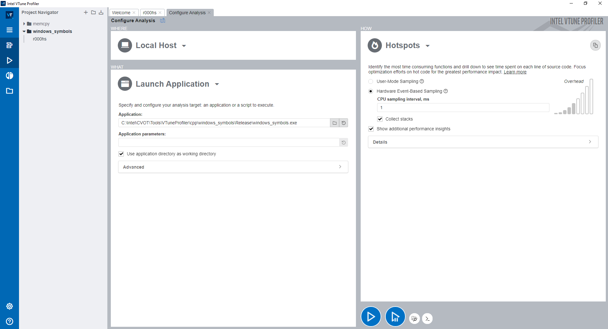
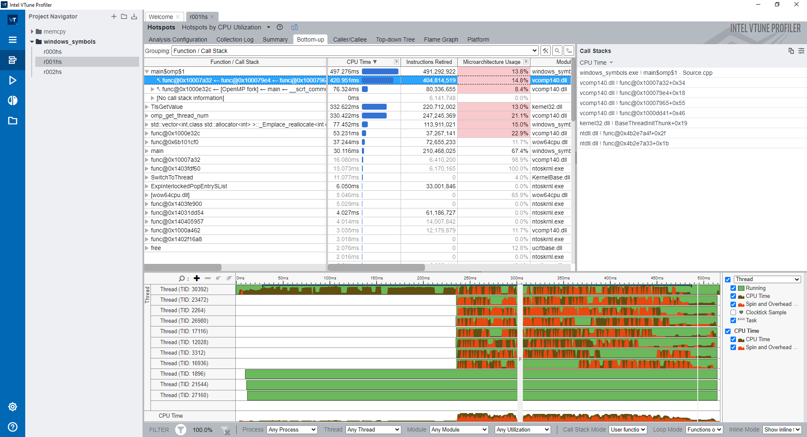
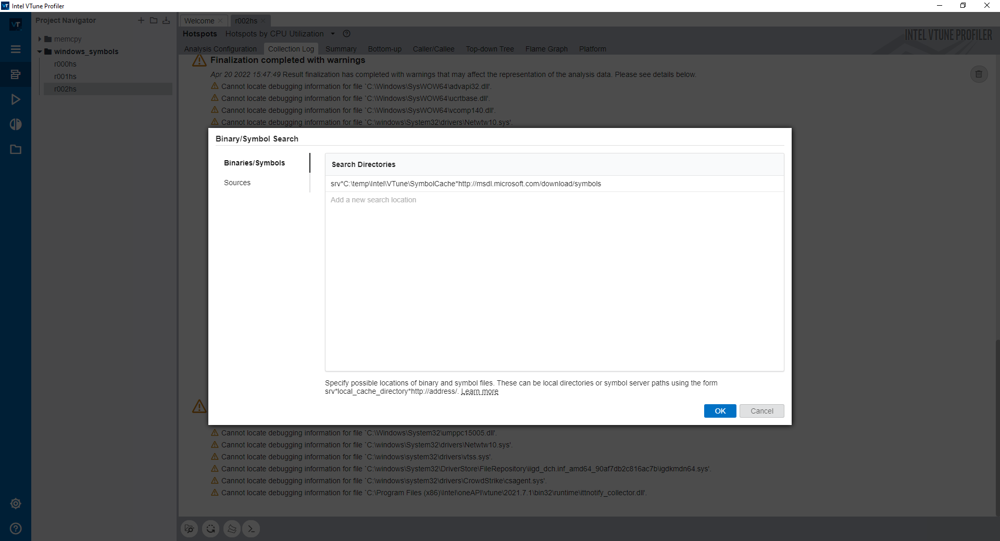
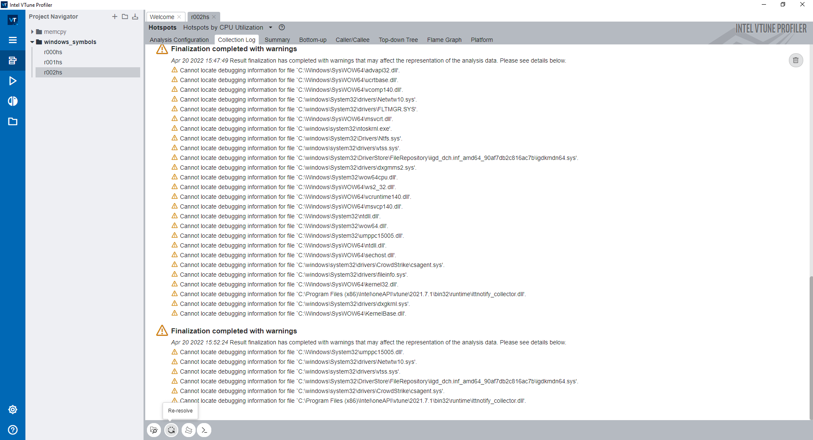
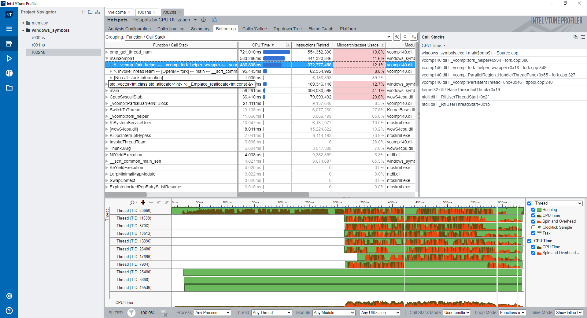

# **Enable Debug Information for Windows System Libraries in VTune Profiler**

## **Introduction**

This tutorial shows how to enable debug information for Windows System libraries with a sample project.

## **Environment Setup**

[Install Intel VTune Profiler](https://www.intel.com/content/www/us/en/develop/documentation/vtune-help/top/installation.html)

## **Run Hotspots Analysis**

In this part of the tutorial, you build the sample project in Visual Studio and run the Hotspots analysis of Intel VTune Profiler.

**Launch VTune Profiler GUI and Create a New Project**
The first step towards analyzing an application in VTune Profiler is to create a project. A project is a container that holds analysis target configuration and data collection results.

---

**NOTE:**

- You may need to run VTune Profiler as **Administrator** to use certain analysis types.
- When you analyze your own application, make sure to build it in the Release mode with full optimizations and establish a performance baseline before running a full analysis. 
- To make sure that the performance data is accurate and repeatable, it is recommended to run the analysis while the system is running a minimal amount of other software.

---

**Run Performance Snapshot Analysis**

Click the **Start** button to start the Hotspots analysis for the sample application.

VTune Profiler finalizes the collected results and opens the **Summary** viewpoint of the Hotspots analysis.

## Open Bottom-up Tab of the Hotspots Analysis Result

At this point in the tutorial, you would observe some binary address information in the call stack, similar as below:

>`windows_symbols.exe ! main$omp$1 - Source.cpp`  
>`vcomp140.dll ! func@0x10007a32 + 0x34`  
>`vcomp140.dll ! func@0x100079e4 + 0x18` 
>`vcomp140.dll ! func@0x10007965 + 0x55`  
>`vcomp140.dll ! func@0x1000dd41 + 0x46`  
>`kernel32.dll ! BaseThreadInitThunk + 0x19`  
>`ntdll.dll ! func@0x4b2e7a4f + 0x2f`  
>`ntdll.dll ! func@0x4b2e7a33 + 0x1b`  

Next step, to enable debug information for Windows System libraries.

## Configure the Microsoft Symbol Server from the VTune Profiler Standalone GUI

1. Open Collection Log Tab of the Hotspots analysis result.

2. Click the **Search Binaries** button at the bottom.

3. Add the following string to the list of search directories:

   srv\*C:\local_symbols_cache_location\*http://msdl.microsoft.com/download/symbols

   where *local_symbols_cache_location* is the location of local symbols. The debug symbols for system libraries will be downloaded to this location.

---

**NOTE:**

- If you use the symbol server, the finalization process may take a long time to complete the first time the VTune Profiler downloads the debug information for system libraries to the local directory specified (for example, C:\local_symbols_cache_location). Subsequent finalizations should be faster.

- If you specify different directories for different projects, the files will be downloaded multiple times, adding unwanted overhead. If you have a Visual Studio project that defines a cache directory for the symbol server, use the same directory in the standalone VTune Profiler so that you do not waste time and space downloading symbols that already exist in a cache directory.

---

**Re-solve and Open the Hotspot Analysis Result**

For newly collected results, the VTune Profiler downloads debug information for system libraries automatically while finalizing the results. For previous results, however, you need to re-finalize the results so that the VTune Profiler can download the debug information for system libraries. To start re-finalizing the result, click   **Re-resolve** in the Collection Log Tab of the Hotspots analysis result.

In this tutorial, we  **Re-resolve** the result data, as below:

Then open Bottom-up Tab again, you will observe the meaningful Windows symbols in call stack, similar as below:

>`windows_symbols.exe ! main$omp$1 - Source.cpp`  
>`vcomp140.dll ! _vcomp::fork_helper + 0x34 - fork.cpp:386`  
>`vcomp140.dll ! _vcomp::fork_helper_wrapper + 0x18 - fork.cpp:348`  
>`vcomp140.dll ! _vcomp::ParallelRegion::HandlerThreadFunc + 0x55 - fork.cpp:327`  
>`vcomp140.dll ! _vcomp::PersistentThreadFunc + 0x46 - ttpool.cpp:240`  
>`kernel32.dll ! BaseThreadInitThunk + 0x19`  
>`ntdll.dll ! _RtlUserThreadStart + 0x2f`  
>`ntdll.dll ! _RtlUserThreadStart + 0x1b`  

Build the project and analyze performance after optimization.

---

**NOTE:**

Follow [these steps](https://docs.microsoft.com/en-us/cpp/build/reference/openmp-enable-openmp-2-0-support?view=msvc-170#to-set-this-compiler-option-in-the-visual-studio-development-environment) to enable OpenMP support in Visual Studio

---

More information on [Debug Information for Windows* System Libraries](https://www.intel.com/content/www/us/en/develop/documentation/vtune-help/top/set-up-analysis-target/windows-targets/debug-information-for-windows-system-libraries.html).

