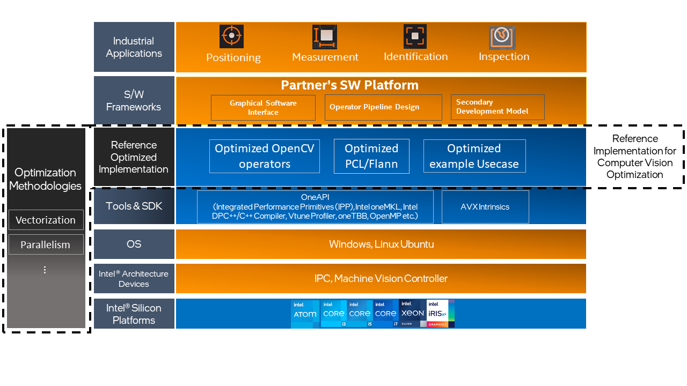
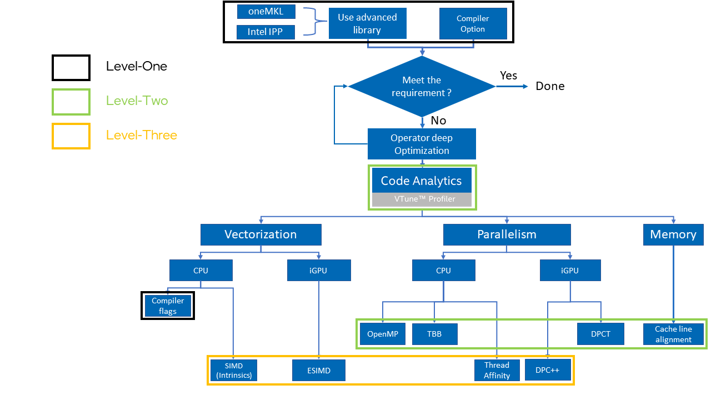
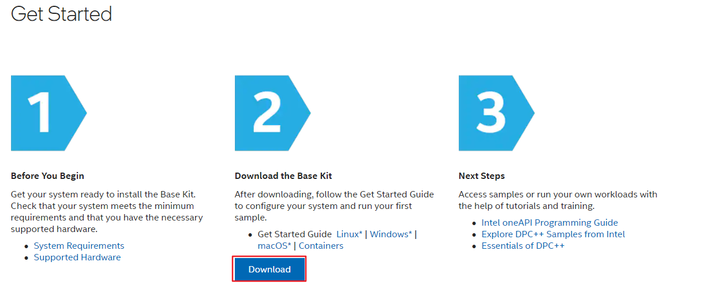
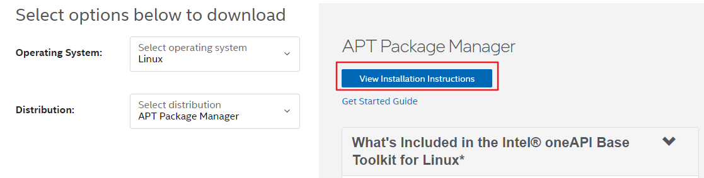
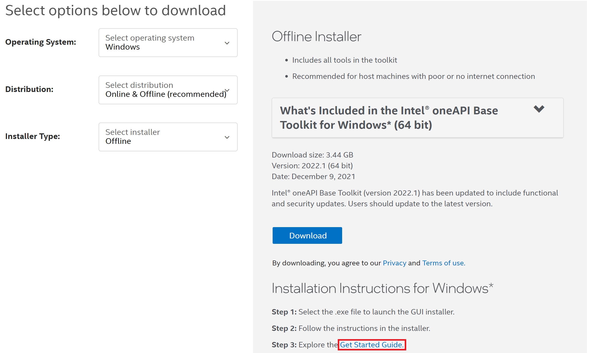

# Reference Implementation for Computer Vision Optimization （CVOI）
This is a one-stop BKM summary from customer-requested computer vision optimization cases. Previously we also have some separate whitepaper, but the quantities are limited and scattered, this guide will act as a well-structured index for all BKMs to easier access for new customers. From the technical side, it covers computer vision program optimization progress, including how to find the hotspots of the program, how to optimize the hotspots, and how many methods we have to do the optimization, which includes three different levels of optimization methodologies. We pack all these reference implementations and optimization methodologies together. This is the so-called **Reference Implementation for Computer Vision Optimization （CVOI）**.

---
## About CVOI
The following figure shows the stack overview of CVOI. We can obviously position the CVOI in the whole system stack. It contains the optimization Methodologies which help to build references to optimized Implementations such as Optimized OpenCV operators, Optimized PCL/Flann Libraries, and Optimized example use cases. To summarize, CVOI gives you a guide on how to optimize your Machine vision solution using the Optimization Method based on different levels from silicon to the various tools and SDK.

The following flow chart presents a general optimization flow for common MV solution optimization. Blocks with different colors represent different levels of Optimization. 

CVOI helps to answer the following questions:

1. How can we position the inefficient part in our MV project (Software Platform, CV Operators, Pipeline Cycle Time )? 
Use Code Analysis Tool.
2. How can we improve the performance with the least effort?
Leverage Compiler, Intel Optimized Libraries.
3. What are the key points we should keep in mind when we want to deeply optimze our solution?
    **T**hink in Parallel (Parallelism)
    **O**ffload to accelerator
    **D**ata in Parallel (Vectorization)
    **O**ptimize Algorithm

## What's inside CVOI
The following directory structure gives a brief overview of CVOI package.
Inside **Reference Optimized Implementation**, we provide the reference implementation of *Optimized OpenCV operators*, *Optimized PCL/Flann*, and *Optimized Example Usecases*, which are all based on our optimization methodologies.
Inside **Optimization Methodologies**, we provide sample codes of how to implement specific optimization methods such as vectorization, parallelism, etc. Additionally, we offer guidance of how to use optimized libraries along with how to switch different compilers and use code analysis tools.

```
|- Reference-Optimized-Implementation 
    |- Optimized OpenCV operators
        |- CPU-Implementation
        |- GPU-Implementation
    |- Optimized-PCL&Flann
    |- Optimized-Example-Use-Cases
|- Optimization-Methodologies
    |- Vectorization
        |- Intrinsics
    |- Parallelism
    |- Optimized-Libraries
    |- Using-Compiler-and-Analysis-Tools
```

[**Reference Optimized Implementation**](./Reference-Optimized-Implementation/)

* [**Optimized-OpenCV-Operators**](./Reference-Optimized-Implementation/Optimized-OpenCV-Operators/) : Serval optimized CV operators code samples
    * [CPU-Implementation](./Reference-Optimized-Implementation/Optimized-OpenCV-Operators/CPU%20Implementation/)
    * [GPU-Implementation](./Reference-Optimized-Implementation/Optimized-OpenCV-Operators/GPU%20Implementation/)

* [**Optimized-PCL&Flann**](./Reference-Optimized-Implementation/Optimized-PCL%26FLann/): Optimized PCL/Flann Libraries which are based on DPC++
* [**Optimized-Example-Use-Cases**](./Reference-Optimized-Implementation/Optimized-Example-Use-Cases/): An example use case that shows how to improve the performance of a whole preprocessing pipeline.

[**Optimization-Methodologies**](./Optimization-Methodologies/)

* [**Vectorization**](./Optimization-Methodologies/Vectorization/): Given examples to show how to use SIMD directly to the program
    * Intrinsics
* [**Parallelism**](./Optimization-Methodologies/Parallelism/): Samples show how to implement basic parallelism with OpenMP and oneTBB
* [**Optimized-Libraries**](./Optimization-Methodologies/Optimized-Libraries/): Samples show how to utilize the intel-optimized advanced libraries
* [**Using-Compiler-and-Analysis-Tools**](./Optimization-Methodologies/Using-Compiler-and-Analysis-Tools/): Samples show how to use Vtune and Intel compiler to directly analyze the code and improve performance

---
## Quick Start Guide
The instructions describe how to set up environment to compile and run DPC++ sample code on **Linux** and **Windows**.

### Table of Contents
- [Operation System](#operation-system)
- [Prerequisites](#prerequisites)
- [Install Intel® oneAPI Base Toolkit on Linux](#install-intel-oneapi-base-toolkit)  - Ver: 2022.2
- [Install Intel® oneAPI Base Toolkit on Windows](#install-intel-oneapi-base-toolkit-on-windows) - Ver: 2022.2

- [Install OpenCV](#install-opencv)


---
### Operation System
1. Linux distribution (Ubuntu 20.04.3 LTS)
    ```bash
    $ cat /etc/lsb-release
    DISTRIB_ID=Ubuntu
    DISTRIB_RELEASE=20.04
    DISTRIB_CODENAME=focal
    DISTRIB_DESCRIPTION="Ubuntu 20.04.3 LTS"
    
    $ uname -a
    Linux intel-NUC11PAHi7 5.11.0-27-generic #29~20.04.1-Ubuntu SMP Wed Aug 11 15:58:17 UTC 2021 x86_64 x86_64 x86_64 GNU/Linux
    ```

1. Windows (Microsoft® Windows10)
    Version 21H2 (OS Build 19044.1469)

---
### Prerequisites
1. Ubuntu*
    ```bash
    $ sudo apt install git
    ```

2. Windows*
    [git for windows](https://git-scm.com/download/win)

---
### Install Intel® oneAPI Base Toolkit on Linux
1. Download Intel® oneAPI Base Toolkit from  [Intel® oneAPI Base Toolkit](https://software.intel.com/content/www/us/en/develop/tools/oneapi/base-toolkit.html)

    

    Next to select options to download:  
    For Ubuntu
    

    Visit the link above and it will navigate to [Intel® oneAPI Toolkits Installation Guide for Linux* OS](https://www.intel.com/content/www/us/en/develop/documentation/installation-guide-for-intel-oneapi-toolkits-linux/top/installation/install-using-package-managers/apt.html)

1. Pre-installation Steps

   1. Set up your package manager to use the Intel® repository:
      - Get the Intel® Repository public key and install it
        ```bash
        # use wget to fetch the Intel® repository public key
        $ cd /tmp
        $ wget https://apt.repos.intel.com/intel-gpg-keys/GPG-PUB-KEY-INTEL-SW-PRODUCTS.PUB
        
         
        # add to your apt sources keyring so that archives signed with this key will be trusted.
        $ sudo apt-key add GPG-PUB-KEY-INTEL-SW-PRODUCTS.PUB
        
        # remove the public key
        $ rm GPG-PUB-KEY-INTEL-SW-PRODUCTS.PUB
        ```

      - Configure the APT client to use Intel®’s repository
         ```bash
         $ echo "deb https://apt.repos.intel.com/oneapi all main" | sudo tee /etc/apt/sources.list.d/oneAPI.list  
         ```

      - Update newest versions of packages and their dependencies
         ```bash
         $ sudo apt update
         ```

1. Install Packages

    - Install the needed package with the following command:
      ```
      $ sudo apt install intel-basekit=2022.2.0-262
      ```

    - After oneAPI tools are installed, set up environment variables to access the tools:

      - Option 1: Source __setvars.sh__ once per session  
        Source __setvars.sh__ every time you open a new terminal window:

        ```
        $ . /opt/intel/oneapi/setvars.sh
        ```

      - Option 2: One time setup for __setvars.sh*__

        To have the environment automatically set up for your projects, include the command source *<install_dir>*/setvars.sh in a startup script where it will be invoked automatically (replace *<install_dir>* with the path to your oneAPI install location). The default installation locations are */opt/intel/oneapi/* for sudo or root users and *~/intel/oneapi/* when installed as a normal user.  
        For example, you can add the source *<install_dir>*/setvars.sh command to your ~/.bashrc or ~/.bashrc_profile or ~/.profile file.

---
### Install Intel® oneAPI Base Toolkit on windows
1. Download Intel® oneAPI Base Toolkit from  [Intel® oneAPI Base Toolkit](https://software.intel.com/content/www/us/en/develop/tools/oneapi/base-toolkit.html)

    

    Next to select options to download:  
    For Windows
    

1. Pre-installation Steps

   Install Microsoft® Visual Studio 2019, following [these steps](https://docs.microsoft.com/en-us/visualstudio/install/install-visual-studio?view=vs-2019).

1. Install oneAPI Packages

    - Install the needed package with the installation instrunction on the page above.

    - After oneAPI tools are installed, visit the link above and it will navigate to [Get Started with the Intel® oneAPI Base Toolkit for Windows*](https://www.intel.com/content/www/us/en/develop/documentation/get-started-with-intel-oneapi-base-windows/top.html).
    
    - set up environment variables to access the tools by command line:
      - Open a command window
      - Set system variables by running __setvars.bat__: 
        Source __setvars.bat__ every time you open a new command window:
        ```
        > "C:\Program Files (x86)\Intel\oneAPI\setvars.bat"
        ```

      - *Note: For Windows PowerShell users, execute this command:*
        ```
        > cmd.exe "/K" '"C:\Program Files (x86)\Intel\oneAPI\setvars.bat" && powershell'
        ```

### Install OpenCV

In CVOI we use the OpenCV library inside [OpenVINO](https://www.intel.com/content/www/us/en/developer/tools/openvino-toolkit/download.html).
You can follow the [installation guide](https://docs.openvino.ai/latest/openvino_docs_install_guides_installing_openvino_linux.html) to download and install OpenVINO.

You can also download OpenCV from the official homepage [OpenCV](https://opencv.org/releases/).

