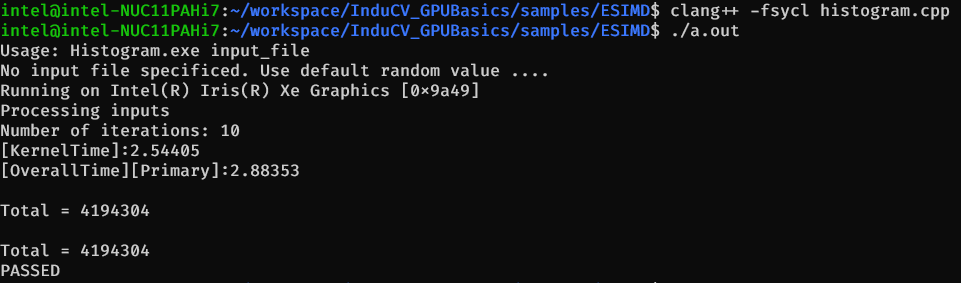

# ESIMD implementation on Linux

## Intel "Explicit SIMD" SYCL extension

Intel OneAPI provides the Explicit SIMD SYCL extension (or simply "ESIMD") for lower-level Intel GPU programming. See ["Explicit SIMD"](https://github.com/intel/llvm/tree/sycl/sycl/doc/extensions/experimental/sycl_ext_intel_esimd) and ["Explicit SIMD SYCL* Extension"](https://www.intel.com/content/www/us/en/develop/documentation/oneapi-dpcpp-cpp-compiler-dev-guide-and-reference/top/optimization-and-programming-guide/vectorization/explicit-vector-programming/explicit-simd-sycl-extension.html) for reference.

| Implementation on                 | Description
|:---                               |:---
| OS                                | Linux* Ubuntu* 20.04
| Hardware                          | Tigerlake with GEN11 / Intel Xe Graphics
| Software                          | Intel® oneAPI DPC++/C++ Compiler 2022.2.0

---

## License
Code samples are licensed under the MIT license. See
[License.txt](https://github.com/intel-innersource/applications.industrial.machine-vision.computer-vision-optimization-toolkit/blob/master/License.txt) for details.

### Using Visual Studio Code*  (Optional)

You can use Visual Studio Code (VS Code) extensions to set your environment, create launch configurations,
and browse and download samples.

The basic steps to build and run a sample using VS Code include:
 - Download a sample using the extension **Code Sample Browser for Intel oneAPI Toolkits**.
 - Configure the oneAPI environment with the extension **Environment Configurator for Intel oneAPI Toolkits**.
 - Open a Terminal in VS Code (**Terminal>New Terminal**).
 - Run the sample in the VS Code terminal using the instructions below.

To learn more about the extensions and how to configure the oneAPI environment, see
[Using Visual Studio Code with Intel® oneAPI Toolkits](https://software.intel.com/content/www/us/en/develop/documentation/using-vs-code-with-intel-oneapi/top.html).

After learning how to use the extensions for Intel oneAPI Toolkits, return to this readme for instructions on how to build and run a sample.

## Before You Begin

1. ESIMD is included in the Intel® oneAPI DPC++/C++ Compiler (at least 2021.4). There are two ways to source the oneAPI DPC++/C++ Compiler:
    1. Intel® oneAPI DPC++/C++ Compiler is included in the Intel® oneAPI Base Toolkit. If you have not installed the Intel® oneAPI Base Toolkit, follow the instructions in [Install Intel® oneAPI Base Toolkit](../../README.md#install-intel-oneapi-base-toolkit) or in the [Official Installation Guide](https://software.intel.com/content/www/us/en/develop/articles/installation-guide-for-intel-oneapi-toolkits.html).
    1. Intel® oneAPI DPC++/C++ Compiler is also included in latest DPC++ Compiler. If you have not installed latest DPC++ Compiler, follow the instructions in [Install Latest DPC++ Compiler](../../README.md#install-latest-dpc-compiler).

1. If you want to run ESIMD code on Intel® GPU, you should install Intel® GPU Driver. If you have not installed it, follow the instruncions in [Install Intel® GPU Driver](../../docs/README.md#install-intel-gpu-driver).

---
## Quick Test On Example ESIMD Code
Assuming that you already download or clone a full copy of to which this guide is attached. Follow below directions to compile and run some ESIMD source files forked from subdirectory of [llvm-test-suite](https://github.com/intel/llvm-test-suite).

1. Navigate to this repository `DirectProgramming/ESIMD/src` subfolder and active the environment variables::
    ```bash
    $ cd <Repo_name>/DirectProgramming/ESIMD/src

    $ source /tmp/dpcpp_compiler/startup.sh
    ```
    Make sure that dpcpp_compiler was deployed following [Install Latest DPC++ Compiler](../../README.md#install-latest-dpc-compiler).

2. Compile sample code and run test:
      ```
      $ clang++ -fsycl histogram.cpp
      $ ./a.out
      ```
      
    Several sample codes exist in the current folder for a fast test.

    or compile sample code by `CMakeLists.txt`:
       ```
        $ cd <Repo_name>/DirectProgramming/ESIMD

        $ mkdir build
        $ cd build
        $ cmake ..
        $ make

        # Run the program
        $ make run-histogram

        # Clean the program
        $ make clean
       ```

---
## DPC++/ESIMD Mixed Programming
Assuming that you already download or clone a full copy of to which this guide is attached. Follow below directions to compile and run some source files forked from subdirectory of [llvm-test-suite](https://github.com/intel/llvm-test-suite).

1. Prepare the environment to be able to use the Intel® oneAPI DPC++/C++ Compiler
    - Option 1: Source Intel® oneAPI Base Toolkit
        Set system variables by running __setvars.sh__:
        ```
        $ . /opt/intel/oneapi/setvars.sh
        ```

    - Option 2: Use latest DPC++/C++ Compiler
        Set system variables by running __startup.sh__:
        ```
        # enter dpcpp_compiler/
        $ cd /tmp/dpcpp_compiler/
        # Active the environment variables:
        $ source startup.sh 
        ```

1. Navigate to [src](./src) folder in this repository `DirectProgramming/ESIMD/src` subfolder:
    ```bash
    $ cd <Repo_name>/DirectProgramming/ESIMD/src
    ```

1. Compile and run the DPC++/ESIMD Mixed Programming code
    ```
    $ clang++ -fsycl sycl_esimd_mix.cpp -o sycl_esimd_mix
    $ ./sycl_esimd_mix
    Running on Intel(R) Iris(R) Xe Graphics [0x9a49]
    SYCL kernel passed
    Running on Intel(R) Iris(R) Xe Graphics [0x9a49]
    ESIMD kernel passed
    ```
---
