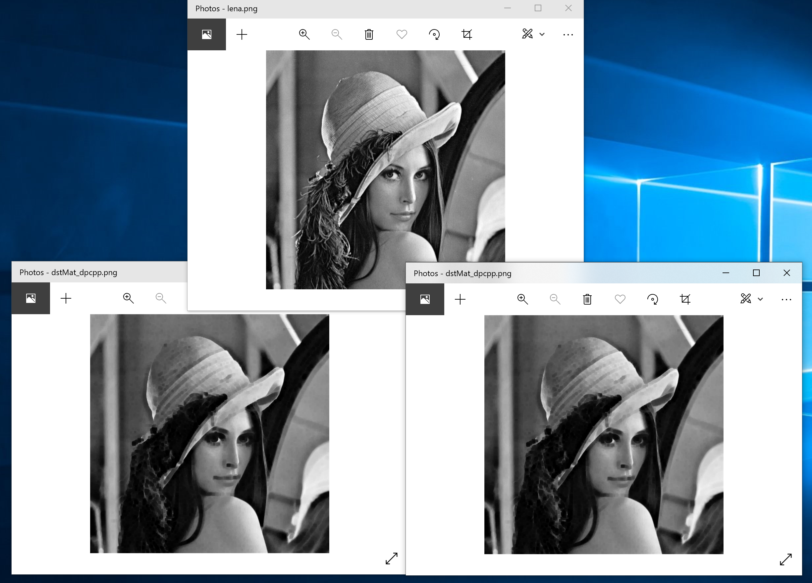

# DPC++ Erosion
## Introduction
This sample illustrates how CVOI helps to improve the computational efficiency to execute the Erosion. This Erosion sample code is implemented using C++ for GPU.

## Key Implementation Details
As is mentioned in the description of CVOI, We provide three different levels of optimization methods to help to build high-performance MV solutions. In `Erosion` case. The Following methods have been utilized:

* **Level Two**:  
    DPCT: [DPCT migration](#dpct-migration)
* **Level Three**:  
    1. DPC++: [DirectProgramming](#directprogramming)
    2. ESIMD:[Leverage ESIMD](#esimd)

### DPCT migration
The Intel DPC++ Compatibility Tool (dpct) can migrate projects that include multiple source and header files. This sample contains the result of Erosion from CUDA-sample to DPC++ sample code on **Linux** and steps to run the DPCPP Erosion. For more details, please refer to [DPCT](https://www.intel.com/content/www/us/en/develop/documentation/intel-dpcpp-compatibility-tool-user-guide/top.html).
### DirectProgramming
For more information about DirectProgramming, please refer to [DirectProgramming](https://www.intel.com/content/www/us/en/develop/documentation/get-started-with-dpcpp-compiler/top.html).
Here when finishing the migration from CUDA code, we need to do some modification on the migrated code to make the program run correctly.
### ESIMD
Intel OneAPI provides the Explicit SIMD SYCL extension (or simply "ESIMD") for lower-level Intel GPU programming. See ["Explicit SIMD"](https://github.com/intel/llvm/tree/sycl/sycl/doc/extensions/ExplicitSIMD) and ["Explicit SIMD SYCL* Extension"](https://www.intel.com/content/www/us/en/develop/documentation/oneapi-dpcpp-cpp-compiler-dev-guide-and-reference/top/optimization-and-programming-guide/vectorization/explicit-vector-programming/explicit-simd-sycl-extension.html) for reference.
For more information about how to implement ESIMD, please refer to [ESIMD](../../DirectProgramming/ESIMD/).
Here we use ESIMD to accelerate the computation of erosion in the kernel function. We pack the values into vector and use vectorization to accelerate the whole process.

## Building the Erosion sample
### Requirement
| Implementation on   | Description                                        |
| :------------------ | :------------------------------------------------- |
| OS                  | Linux* Ubuntu* 20.04;                              |
| Hardware            | Tigerlake with GEN11 / Intel Xe Graphics           |
| Software            | Intel® oneAPI DPC++/C++ Compiler 2022.2.0          |

---

## Before You Begin

1. There are two ways to source the oneAPI DPC++/C++ Compiler:
    1. Intel® oneAPI DPC++/C++ Compiler is included in the Intel® oneAPI Base Toolkit. If you have not installed the Intel® oneAPI Base Toolkit, follow the instructions in [Install Intel® oneAPI Base Toolkit](../../README.md#install-intel-oneapi-base-toolkit) or in the [Official Installation Guide](https://software.intel.com/content/www/us/en/develop/articles/installation-guide-for-intel-oneapi-toolkits.html).
    1. Intel® oneAPI DPC++/C++ Compiler is also included in latest DPC++ Compiler. If you have not installed latest DPC++ Compiler, follow the instructions in [Install Latest DPC++ Compiler](../../README.md#install-latest-dpc-compiler).

1. If you want to run DPCPP code on Intel® GPU, you should install Intel® GPU Driver. If you have not installed it, follow the instruncions in [Install Intel® GPU Driver](../../README.md#install-intel-gpu-driver).

1. Install Intel® Distribution of OpenVINO™ toolkit (at least 2021.1)  
    See [Setup Intel® Distribution of OpenVINO™ Toolkit](../../README.md#install-intel-distribution-of-openvino-toolkit)

### Using Visual Studio Code*  (Optional)

You can use Visual Studio Code (VS Code) extensions to set your environment, create launch configurations,
and browse and download samples.

The basic steps to build and run a sample using VS Code include:
 - Download a sample using the extension **Code Sample Browser for Intel oneAPI Toolkits**.
 - Configure the oneAPI environment with the extension **Environment Configurator for Intel oneAPI Toolkits**.
 - Open a Terminal in VS Code (**Terminal>New Terminal**).
 - Run the sample in the VS Code terminal using the instructions below.

To learn more about the extensions and how to configure the oneAPI environment, see
[Using Visual Studio Code with Intel® oneAPI Toolkits](https://software.intel.com/content/www/us/en/develop/documentation/using-vs-code-with-intel-oneapi/top.html).

After learning how to use the extensions for Intel oneAPI Toolkits, return to this readme for instructions on how to build and run a sample.


## DPC++ Erosion
Assuming that you already download or clone a full copy of to which this guide is attached. Follow below directions to compile and run some source files.

1. Prepare the environment to be able to use the Intel® oneAPI DPC++/C++ Compiler and Navigate to this repository `Practices/Erosion` subfolder:

   ```
   $ source /opt/intel/oneapi/setvars.sh
   $ export SYCL_DEVICE_FILTER=opencl:gpu
   $ cd <Repo_name>/Practices/Erosion/
   ```

1. Build and run DPCPP Erosion source code 
   Directives to build and run DPCPP Erosion source code migrated from CUDA sample.
   
   ```
    $ mkdir build
    $ cd build
    $ cmake ..
    $ make

    # Run the program
    $ make run-erosion

    # Clean the program
    $ make clean
   ```
   *Note: If you install the openCV not in default path, or install another veresion of openCV, you should change the path in the [CMakeLists.txt](./src/CMakeLists.txt)*

1. Example of Output.
```bash
Erosion CPU: 0.0386362ms
GPU two steps erosion: 0.0123536ms
Great!!
```
   The code will generete result image in `resource` folder.

   
