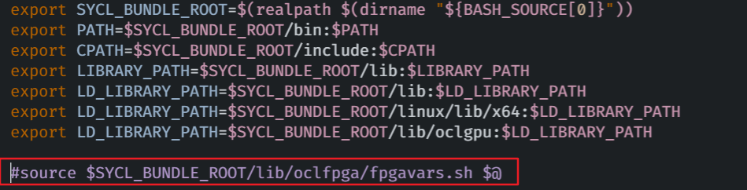
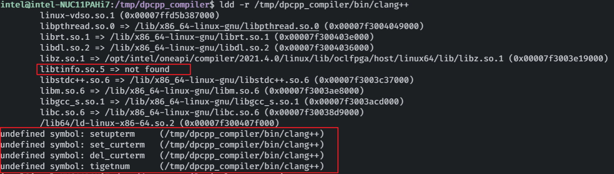
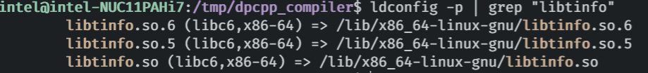
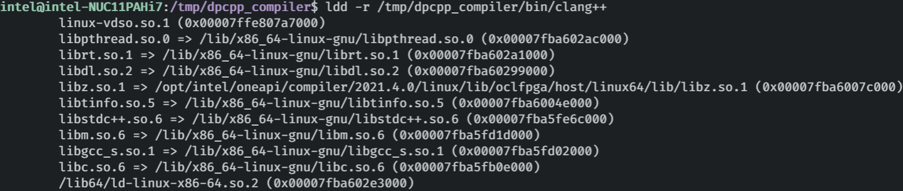
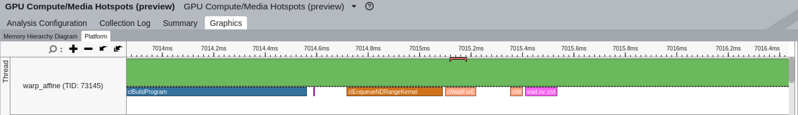
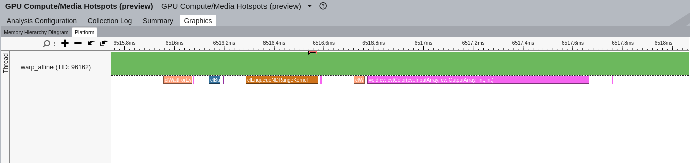

# GPU Offload Flow
GPUs are special-purpose compute devices that can be used to offload a compute intensive portion of your application. GPUs usually consists of many smaller cores and are therefore known for massive throughput. There are some tasks better suited to a CPU and others that may be better suited to a GPU. Offloading a program to a GPU defaults to the level zero runtime. There is also an option to switch to the OpenCL™ runtime. In SYCL* and OpenMP* offload, each work item is mapped to a SIMD lane. A subgroup maps to SIMD width formed from work items that execute in parallel and subgroups are mapped to GPU EU thread. Work-groups, which include work-items that can synchronize and share local data, are assigned for execution on compute units (that is, streaming multiprocessors or Xe core, also known as sub-slices). Finally, the entire global NDRange of work-items maps to the entire GPU.

- [Subfolder Information](#subfolder-information)
- [Set Up for GPU Offload](#set-up-for-gpu-offload)
- [Setup DG1 Environment](#setup-dg1-environment)
- [Ahead of Time Compilation](#ahead-of-time-compilation)

## Subfolder Information
### Common
- [OpenvinoDpcppMixed](./Common/OpenvinoDpcppMixed): Openvino and DPC++ mixed project.

### DirectProgramming
- [ESIMD](./DirectProgramming/ESIMD): ESIMD samples (contains sycl-esmid-mixed programming).

### Practices
- [GaussianBlur](./Practices/GaussianBlur): GaussianBlur sample on Linux and Windows.

- [MorphOpen](./Practices/MorphOpen): Morphology Open operation
- [Rgb2Hsv](./Practices/Rgb2Hsv): Rgb to Hsv algorithm in DPC++.
- [SobelGradient](./Practices/SobelGradient): SobelGradient code in DPC++ on Linux and Windows.
- [Canny](./Practices/Canny): Canny code in DPC++
- [Erosion](./Practices/Erosion): Erosion code in DPC++.
- [WarpAffine](./Practices/WarpAffine): Warp-affine code in DPC++.


## Set Up for GPU Offload
Make sure you have followed all steps in the oneAPI Development Environment Setup section.
Configure your GPU system by installing drivers and add the user to the video group. See the Get Started Guide for instructions.

### Table of Contents
- [Install Intel® GPU Driver](#install-intel-gpu-driver)
- [Install Intel® GPU Driver on Windows](#install-intel-gpu-driver-on-windows)
- [Install Latest DPC++ Compiler](#install-latest-dpc-compiler)

### Install Intel® GPU Driver

**For GPU Users, Install GPU Drivers**

If you followed the instructions in the Installation Guide to install GPU Drivers, you may skip this step. If you have not installed the drivers, follow the directions in below or in the [Installation Guide](https://dgpu-docs.intel.com/installation-guides/index.html).

To install the latest general purpose GPU (GPGPU) software packages on Ubuntu 20.04 (focal), add the Intel® software package repository and install the appropriate packages.

1. Add package repository

    ```
    $ sudo apt-get install -y gpg-agent wget

    $ wget -qO - https://repositories.intel.com/graphics/intel-graphics.key |  sudo apt-key add -

    $ sudo apt-add-repository  'deb [arch=amd64] https://repositories.intel.com/graphics/ubuntu focal main'
    ```

1. Install run-time packages

    ```
    $ sudo apt-get update

    $ sudo apt-get install  intel-opencl-icd  intel-level-zero-gpu level-zero  intel-media-va-driver-non-free libmfx1
   ```

1. Install developer packages(**Optional**)

    ```
    $ sudo apt-get install  libigc-dev  intel-igc-cm  libigdfcl-dev  libigfxcmrt-dev  level-zero-dev
    ```

1. Configuring permissions 

    ```
    $ stat -c "%G" /dev/dri/render*
    ```

    ```
    $ groups ${USER}
    ```

---
### Install Intel® GPU Driver on Windows

**For GPU Users, Install GPU Drivers**

If your windows system has already installed GPU Drivers, you may skip this step. If you have not installed the drivers, follow the directions the directions in below or in the [Installation Guid on Windows](https://www.intel.com/content/www/us/en/develop/documentation/get-started-with-intel-oneapi-base-windows/top/before-you-begin.html).

1. Visit [Intel Graphics Drivers](https://www.intel.com/content/www/us/en/support/products/80939/graphics.html) to download the driver

1. Click on the latest version of **Intel® Graphics - Windows® 10 DCH Drivers**.

1. Run the installer.

---
### Install Latest DPC++ Compiler

1. Download the latest binary packages from [DPC++ daily 2021-11-20](https://github.com/intel/llvm/releases/tag/sycl-nightly%2F20211120)

    Or get the binary package using wget tool in command line:
    ```
    $ wget -c https://github.com/intel/llvm/releases/download/sycl-nightly%2F20211120/dpcpp-compiler.tar.gz -P /tmp
    ```
    This command will download packages to /tmp directory.

1. Install DPC++ compiler:

   - Ucompress the tarball:

     ```
     $ cd /tmp  # switch to /tmp directory
     $ tar xvzf dpcpp-compiler.tar.gz

     # enter dpcpp_compiler/
     $ cd dpcpp_compiler/
     ```

    - Active the environment variables:
      ```
      $ source startup.sh 
      ```

      An issue may be encountered (**Skip** if no issue):
      

      ​Just edit startup.sh file and comment out the last line:
      ​

    - Save before exit, and try:
      ```
      $ source startup.sh
      ```

3. Check the availability of shared libraries to clang++:

    ```
    $ whereis clang++
    clang++: /tmp/dpcpp_compiler/bin/clang++ /opt/intel/oneapi/compiler/2022.2.0/linux/bin/clang++
    ```

    A new issue that cannot linked to _libtinfo.so.5_ (Skip these steps if no issue):
    ```bash
    $ ldd -r /tmp/dpcpp_compiler/bin/clang++
    ```
      

    To fix this issue, following:  
    - Search shared library named libtinfo in current system:
    
      ```bash
      $ ldconfig -p | grep "libtinfo"
      ```
      

      ```bash
      $ find /lib/ -name "libtinfo.so.5"
      ```

      OK, seems that it cannot find the **libtinfo.so.5** on current system.

    - Install **libncurses5** on Ubuntu to add this missing lib:
      ```bash
      $ sudo apt install libncurses5
      ```

    - Check the linkable libraries:

      
      

---
## Setup DG1 Environment

### hardware prerequisite

TGL-RVP + TGL i7 should be at least B0 stepping


### Flash BIOS 

flash BIOS to TGLIFUI1.R00.4024.A01.2101201730, 

after flashed, the bios battery should be take off and reload to motherboard.


### Modify BIOS settings

    *  System Agent（SA）Configuration -> Graphics Configuration -> Primary Display  <HG>

    *  System Agent（SA）Configuration -> Graphics Configuration -> Select PCIE Card  <Auto>

    *  System Agent（SA）Configuration -> Above 4GB MMIO BIOS assignment <Enabled>


### install ubuntu 20.04


### Run the following commands to configure your system:

```bash
set -e

sudo apt-get install -y software-properties-common curl gnupg
curl --noproxy '*' -fsSL https://gfx-assets-build.intel.com/artifactory/api/gpg/key/public | sudo apt-key add -
sudo add-apt-repository 'deb https://gfx-assets-build.intel.com/artifactory/gfx-debs-per-build untested/main/gfx-driver/master/focal gfx-driver-ci-master-8913'
sudo add-apt-repository 'deb https://gfx-assets-build.intel.com/artifactory/gfx-debs-per-build untested/release-internal/linux-i915/dii/focal linux-i915-ci-dii-1744'
sudo add-apt-repository 'deb https://gfx-assets-build.intel.com/artifactory/gfx-debs-per-build untested/main/linux-i915/dii/focal linux-i915-ci-dii-1744'
sudo apt-get update
```

### Meta package that installs all gfx-driver packages

```bash
sudo apt-get install -y intel-gfx-driver
```

### Media Non-Free Driver

```bash
sudo apt-get install -y intel-media-va-driver-non-free
```


### Prerelease Kernel

```bash
sudo apt-get install -y linux-prerelease
```

### install latest intel compute runtime 

refer to https://github.com/intel/compute-runtime/releases/tag/22.01.22131

```bash
mkdir neo
cd neo
wget https://github.com/intel/compute-runtime/releases/download/22.01.22131/intel-gmmlib_22.0.0_amd64.deb
wget https://github.com/intel/intel-graphics-compiler/releases/download/igc-1.0.9933/intel-igc-core_1.0.9933_amd64.deb
wget https://github.com/intel/intel-graphics-compiler/releases/download/igc-1.0.9933/intel-igc-opencl_1.0.9933_amd64.deb
wget https://github.com/intel/compute-runtime/releases/download/22.01.22131/intel-opencl-icd_22.01.22131_amd64.deb
wget https://github.com/intel/compute-runtime/releases/download/22.01.22131/intel-level-zero-gpu_1.2.22131_amd64.deb


sudo dpkg -i *.deb
```

### reboot computer

check the version of kernel version which is 5.10-prerelease 

```bash

uname -r
5.10.5+prerelease1744

```


### check DG1 card

```bash


intel@intel-Tiger-Lake:~/# clinfo
Number of platforms                               1
  Platform Name                                   Intel(R) OpenCL HD Graphics
  Platform Vendor                                 Intel(R) Corporation
  Platform Version                                OpenCL 3.0 
  Platform Profile                                FULL_PROFILE
  Platform Extensions                             cl_khr_byte_addressable_store cl_khr_fp16 cl_khr_global_int32_base_atomics cl_khr_global_int32_extended_atomics cl_khr_icd cl_khr_local_int32_base_atomics cl_khr_local_int32_extended_atomics cl_intel_command_queue_families cl_intel_subgroups cl_intel_required_subgroup_size cl_intel_subgroups_short cl_khr_spir cl_intel_accelerator cl_intel_driver_diagnostics cl_khr_priority_hints cl_khr_throttle_hints cl_khr_create_command_queue cl_intel_subgroups_char cl_intel_subgroups_long cl_khr_il_program cl_intel_mem_force_host_memory cl_khr_subgroup_extended_types cl_khr_subgroup_non_uniform_vote cl_khr_subgroup_ballot cl_khr_subgroup_non_uniform_arithmetic cl_khr_subgroup_shuffle cl_khr_subgroup_shuffle_relative cl_khr_subgroup_clustered_reduce cl_intel_device_attribute_query cl_khr_suggested_local_work_size cl_intel_spirv_media_block_io cl_intel_spirv_subgroups cl_khr_spirv_no_integer_wrap_decoration cl_intel_unified_shared_memory_preview cl_khr_mipmap_image cl_khr_mipmap_image_writes cl_intel_planar_yuv cl_intel_packed_yuv cl_khr_int64_base_atomics cl_khr_int64_extended_atomics cl_khr_image2d_from_buffer cl_khr_depth_images cl_khr_3d_image_writes cl_intel_media_block_io cl_intel_va_api_media_sharing cl_intel_sharing_format_query cl_khr_pci_bus_info cl_intel_subgroup_local_block_io 
  Platform Host timer resolution                  1ns
  Platform Extensions function suffix             INTEL

  Platform Name                                   Intel(R) OpenCL HD Graphics
Number of devices                                 1
  Device Name                                     Intel(R) Iris(R) Xe MAX Graphics [0x4905]
  Device Vendor                                   Intel(R) Corporation
  Device Vendor ID                                0x8086
  Device Version                                  OpenCL 3.0 NEO 
  Driver Version                                  22.01.22131
  Device OpenCL C Version                         OpenCL C 1.2 

....
....  omitted  ....
....

```

## Ahead of Time Compilation
1. Use [Ahead of Time Compilation](https://www.intel.com/content/www/us/en/develop/documentation/oneapi-dpcpp-cpp-compiler-dev-guide-and-reference/top/compilation/ahead-of-time-compilation.html) to reduce kernel running time.

  - Use Intel® Vtune in the Intel® oneAPI Base Toolkit to profile [the dpcpp warp-affine](./WarpAffine/src):
  

  The `clBuildProgram` takes much time of the kernel running time, which is caused by just-in-time (JIT) bugs encountered due to compilation for the target device.

  - Modified Makfile as Ahead of Time Compilation and the Vtune result is:
  
